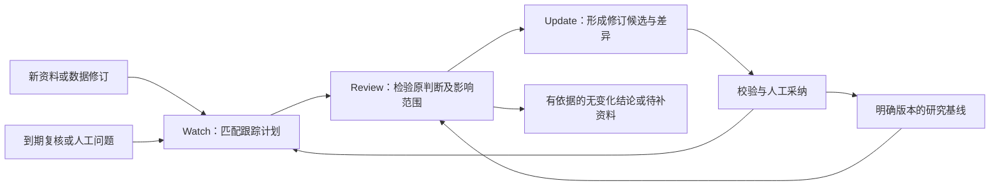
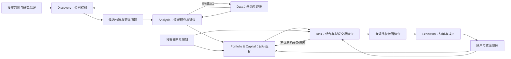

# Uteki Agent 职责与投资闭环提案

- 日期：2026-09-18。
- 状态：六类职责方向已获用户评审认可；补充 Analysis 持续研究与团队协作要求。具体实现、实验效果和版本交付仍分别验收。
- 长期风格：长期多头、偏向充分投资；具体仓位、现金、集中度与授权方式通过策略配置确定。
- 当前执行范围仍为 [M0](M0_SCOPE.zh-CN.md) / [v0.2](releases/V0_2_PLAN.zh-CN.md)。本提案不替代已批准的中英架构规范，不修改前端或启动交易。

## 1. 数量：六类业务职责，运行组织可替换

当前 [架构规范](ARCHITECTURE.zh-CN.md) 定义 Data 与 Analysis 两个逻辑角色。仓库有 BusinessMapAgent、叙事研究与 single/team 实验路径，但尚未形成完整的组合、风控、交易系统。代码文件数、模型调用数和业务职责数不是同一概念。

长期建议定义六类职责，包含用户补充的前置公司挖掘：

| 职责 | 回答的问题 | 交付物 | 不拥有的决定 |
| --- | --- | --- | --- |
| **Discovery Agent** | 哪些公司值得进一步研究，为什么？ | 有依据的候选公司、筛选记录、研究优先级与待验证问题 | 自动认定研究完成、直接给出账户买单 |
| **Data Agent** | 有哪些可用资料，可信度、时点、口径与缺口是什么？ | 版本化来源、带类型的数据、证据、质量诊断与缺口 | 投资建议、账户仓位 |
| **Analysis Agent / Team** | 生意和投资假设是否仍成立，新输入如何改变价值与投资判断？ | 持续维护的投资案例、Watch 计划、Review 记录、模型与研究建议修订 | 账户目标仓位、下单权限 |
| **Portfolio & Capital Agent** | 在现有持仓、资金和投资约束下，应该怎样配置资本？ | 目标组合、现金计划、调仓提案与取舍说明 | 自行放宽风险规则、写入实际成交 |
| **Risk Agent** | 当前组合及拟议交易是否满足约束，有什么集中暴露与下行风险？ | 风险诊断、通过/拒绝/资料不足及违规依据 | 更改研究事实、改写策略限制、直接交易 |
| **Execution Agent** | 如何准确执行有效且获授权的调仓指令？ | 订单状态、成交、费用与对账结果 | 创造新投资观点、自行提高仓位或风险额度 |

组合与资金管理先合并：仓位、现金、购买力与调仓顺序是同一资本分配问题。实际持仓、现金与成交由账户账本和券商对账维护，Agent 只消费明确时点的快照，不能凭叙事修改账本。

六类职责可以留在同一个模块化单体。Agent 也可以是确定性流程；计算、限额检查、订单状态与账本尤其适合可重放程序。是否引入模型由任务需要决定。

**评测系统与人的注意力工作台是贯穿上述职责的两个支撑系统。** 评测不参与业务意见投票，工作台不替代领域规则，不必再各设一个常驻 Agent。

### Discovery：业务入口，复用 Data

公司挖掘从可配置投资范围、研究偏好和可用数据出发，可以结合财务/估值筛选、商业模式、行业变化、资本配置或组合中的研究缺口，提出值得研究的公司。长期价值投资不要求每家公司都存在短期催化剂。

每个候选至少记录公司/证券身份、信息时点、筛选范围与规则版本、触发证据、值得研究的原因、初步风险和未知、下一条研究问题，以及重复/排除记录。初步吸引力是假设，不是已验证投资结论。新候选可以进入待分流队列；是否加入正式观察名单是独立决定。

Discovery 通过 Data 查询横截面指标、事件与来源证据，不另建一套采集和清洗逻辑。业务流程从挖掘开始，但运行依赖可以先调用 Data。研究者直接指定公司时也能进入 Analysis，不必强制经过挖掘。

评价包括候选依据正确性、规则一致性、重复率、人工筛选负担及进入有效深度研究的比例，并记录分母与失败原因。遗漏用预先固定范围的参考集合或分层抽查检验，不能声称测得全市场机会召回率。后续研究确认/推翻的结果分别反馈；不以之后上涨作为唯一正确答案，不把未被研究的公司当作负例。

历史验证保留当时的可投资范围、退市/退出公司、信息可得时间及筛选记录，避免用今天的存续公司和后来数据重做过去的发现。发现、筛选和评测共用数据时明确暴露情况。

公司发现位于业务流程前端；实现上可在单公司研究与评测方法稳定后，于 v0.6 验证小规模发现与迁移。当前公司名单不因本提案发生变化。

## 2. Data：统一契约，保留不同类型的原貌

统一的是身份、来源、时点、版本、查询与证据规则。正文、表格、时间序列、图像和音视频不必被压成同一种文本。

| 数据层 | 内容 | 关键要求 |
| --- | --- | --- |
| 原始来源 | 申报文件、XBRL、业绩会、公告、新闻、行情、行业资料、图像或录音 | 原件和获取记录保留；按当前任务批准来源 |
| 来源索引 | 文档结构、段落、表格行列、图像区域、音视频时间段 | 能回到固定来源位置；解析或转录修正形成新版本 |
| 带类型的数据 | 事实陈述、指标数据点、事件、实体关系、文档上下文 | 保留类型特有的口径、币种、单位、期间和定位 |
| 研究数据发布 | 与 query 对应的数据、证据、覆盖情况与缺口 | 不可变快照；披露冲突、未知与审核状态 |

公共信息包括：对象与数据点身份、来源快照、证据定位、报告期间、发布/可得时间、获取时间、转换版本及审核状态。报告期间不能代替当时可得时间；重述数据不能冒充历史上已知的数字。指标定义与跨期数据点使用不同身份。

事实、来源明确披露的解释、系统推导和人的假设分别标记。Business Map 中有证据的业务经济性整理可沿用当前 Data 职责；关于未来、因果判断与资本价值的假设归 Analysis。

Analysis 通过统一研究数据入口查询结构化结果，也可读取该入口提供的原文上下文；无需把所有原文预先结构化。来源许可、时间截止与读取记录对两种访问方式同样生效。当前已有的 `ResearchDataPort` 与 `ToolSession → DocumentReader` 路径应在实际任务触及时收敛，不能声称它们已统一。

资料不足时返回缺口并生成有原因的数据请求。Analysis 不得将缺失数字默认为零，或把未披露视为事件未发生。

## 3. Analysis：持续研究，按团队协作设计

**Watch、Review、Update 是 Analysis 的核心生命周期；承载团队协作是现在就要明确的架构要求。** Analysis 长期维护公司研究状态，随着新输入持续检验和修订。具体成员、分工和执行图由实验决定，单 Agent 可以作为同一契约下的基线或单成员配置。

建议先定义三个可单独验收的领域任务，并保留一个研究整合步骤：

| 领域 | 主要交付物 | 独立评价内容 |
| --- | --- | --- |
| **业务与假设验证** | 生意解释、关键假设、支持与反证、可观察指标、失效条件及有效期 | 证据支持、反证遗漏、因果跳跃、未知处理、假设是否能被未来信息检验 |
| **财务与经营模型** | 历史数据勾稽、正常化调整、经营驱动、预测与情景 | 来源与口径、公式正确、财务关系、预测误差及其来源；计算正确与预测准确分别评价 |
| **估值与预期回报** | 适用方法、价值区间、价格时点、隐含预期、敏感性与下行路径 | 计算复算、假设一致性、方法适用性、股权/企业价值桥接、现金流重复计算等错误 |
| **研究整合** | 版本化投资案例与可解释的研究建议 | 跨领域矛盾是否解决、结论是否由模型与证据支持、分歧是否被真实保留 |

领域拆分依据是不同的判断对象、输入输出、工具/权限和评价标准。证据正确性、成本、延迟等共通维度可以跨领域评测，不必每一个指标创建一个 Agent。

同一领域任务在不同执行组织下保持输入输出契约稳定，各领域按自己的交付物定义契约并共用运行记录规则。内部可以选择：

- single：一个执行者完成任务；
- multi：多个有边界的任务分工，按依赖关系交接；
- team：执行、质疑、修订等协作组织。

这些名称是本项目对执行配置的约定，不能作为能力高低排序。团队内部 reviewer 属于生产流程，外部评测仍独立。多个模型同意不构成事实证明。

从最简单实现建立基线；只有固定任务上的错误、成本和人工负担改善，才保留更复杂的组织。对照固定来源、信息截止、输入、评价规则与预算条件，保留所有尝试。额外计算投入带来的改善须与组织方式带来的改善分别说明。

模型负责提出假设、选择适用方法、解释与复核；财务和估值数字来自可检查的计算模型，连同输入、公式及版本一起保存。

### 3.1 Watch → Review → Update 的持续闭环

这里的 Watch 是持续研究机制，与研究建议中的 WATCH / 继续观察不同。BUY、HOLD、SELL 或 WATCH 公司都可有跟踪计划；停止或暂停跟踪需要留下明确记录。

| 环节 | 必须做的工作 | 可检查的结果 |
| --- | --- | --- |
| **Watch** | 按公司、业务、假设、指标和来源订阅变化；接收新披露、业绩会、相关行业信息、价格变化、原数据更正、人工输入和到期检查 | 触发事件、来源与时间、关联对象、重要性依据、待处理任务；未获取到资料明确标记覆盖缺口 |
| **Review** | 对照原假设和预测，判定支持、削弱、推翻、无实质影响或无法判断；识别需要重算和重新阅读的范围，检查反证 | 逐项影响记录、正反证据、分歧、数据请求和领域任务；只变价格时可只重估投资吸引力，不虚构经营变化 |
| **Update** | 更新受影响的假设、财务模型、估值和建议；检查它们之间的一致性；修订后续 Watch 计划 | 新候选版本、前后差异、变化原因、依赖来源和待确认事项；采纳后发布新的有效研究版本 |

数据获取与变化发布归 Data；Watch 对变化的研究意义和触发规则归 Analysis。定时唤醒、任务队列、重试与恢复由执行基础设施承担。持续能力通过持久化状态和有界运行实现；每轮有信息截止、任务范围、成本/轮数限制和停止条件。

持久化状态至少包括当前采纳版本、假设及其证据/反证、预测与估值版本、未知与待验证问题、Watch 计划、候选分支、Review 记录，以及“资料已检查到哪里”和“判断已复核到哪里”。模型会话结束或成员更换后应能从这些产物继续工作。

每条 Watch 计划记录关注对象、观察指标与来源、触发条件、复核周期、最近成功检查、最新覆盖范围、责任角色及当前状态。周期和阈值按任务配置；本次讨论不创建实际定时任务。资料迟到、抓取失败或审核积压时显示对应状态，不能因没有事件而判定生意未变。

新输入先形成固定事件批次与数据快照，识别受影响的依赖链，按需重算；业务结构改变、证据冲突或依赖不明确时扩大复核范围。定期完整复核用于检查增量更新是否遗漏重要关联。相同事件去重，无实质变化也记录依据与覆盖范围，不强造新的投资观点。

事件身份应区分来源修订版本：同一版本的重复通知可去重，重述或更正版本必须作为新输入。运行状态（排队、执行中、失败、完成）、研究结果（有变化、无实质变化、资料不足、需纠错、存在分歧/过时）和采纳状态分别保存。

新版本的生成与正式采纳分别记录。未采纳候选不覆盖原判断；原证据被撤回、假设出现重大反证或研究过期时，原版本同时标记需复核或失效，并通知依赖它的组合/风险环节。旧版本保留历史身份，但不能继续被当作已验证的最新输入；候选也不因此获得交易权限。

### 3.2 团队协作需要的最小契约

团队首先是有边界的共同工作流程。建议的角色包括：

| 角色 | 责任与交接 |
| --- | --- |
| **Research Lead / 整合者** | 固定研究问题、基线、数据快照和预算；拆分任务、维护依赖、整合结果并记录取舍；只能提出候选，无权替代人的采纳 |
| **业务与假设研究者** | 检验生意和假设、收集反证、提交受影响对象与修订依据 |
| **财务研究者** | 核对历史及预测、计算驱动变化，交付可复算模型和差异 |
| **估值研究者** | 消费指定财务版本和情景，重算价值/回报，记录敏感性和限制 |
| **Reviewer / 质疑者** | 通过批准的数据入口独立核验关键证据、反证、数字和跨领域矛盾；提交质疑及处理建议 |

这些是 Analysis 内部角色，不增加顶层六类职责。角色可按任务合并；独立子任务可并行，有依赖的任务按指定版本交接，例如估值不能把旧财务输出当作新预测。团队内部 Reviewer 是生产过程中的质量环节；外部评测和人工采纳仍各自独立。

需要明确并保存的对象：

| 对象 | 最小信息 |
| --- | --- |
| **研究状态 / Research Case** | 公司与案例身份、采纳版本、资料有效性/复核状态、领域模型版本、Watch 计划和候选分支 |
| **触发批次 / Review Batch** | 事件身份、已包含的相关事件范围、来源快照、信息截止、基线版本、需要回答的问题 |
| **任务与结果 / Task & Result** | 任务/父任务身份、领域与责任角色、依赖产物版本、来源和工具权限、预算、模型/配置、结构化结果、证据、缺口与执行状态 |
| **复核与修订 / Review & Change Set** | 被审查的产物版本、问题与重要性、处置依据、保留分歧、前后差异，以及采纳所需的基线与事件检查 |

运行治理要求：

1. 共享研究状态在模型外持久化。成员读取固定快照并提交有版本的产物；聊天和自由文本总结只能辅助交接，不能成为唯一事实记录。
2. 成员不能原地改写彼此的结果或正式基线。整合通过显式修订完成，保留作者、来源、依赖和分歧；不以多数投票掩盖证据冲突。
3. 采纳在同一一致性边界内原子核验**基线版本、已判断的相关事件范围和来源有效性**，并写入决定与发布结果；任一前提变化即拒绝旧提交，补审或重试。运行期间出现影响结论的新资料时，标记候选需重基线或补充复核；旧批次不能被标成覆盖了新资料。新事件尚未判断相关性时不能默认无关；确认为无关的事件不阻塞采纳，判断依据留存。
4. 冻结批次有界处理，新事件可进入下一批；重要撤回或失效事件优先使受影响结果失效。任务超时、失败、取消和重试可恢复且不重复提交；超过修订轮数或预算后显式返回未解决问题。
5. 必需领域未完成或关键分歧未解决时，候选保持部分完成/待复核；资料不足和任务失败不能伪装为 HOLD、无变化或团队一致。

### 3.3 持续研究与团队的验收场景

| 场景 | 必须观察到的结果 |
| --- | --- |
| 新财报包含假设相关变化 | 触发 Watch，Review 明确受影响假设，财务→估值→建议的传导及未变化部分可追溯 |
| 无实质变化或重复输入 | 留下可解释的复核记录，重复事件不重复产生处置任务；没有证据时不能声明无变化 |
| 数据迟到、缺失或检查失败 | 跟踪覆盖与研究新鲜度明确失效/降级，生成待补资料状态，不能报告“已持续跟踪” |
| 来源更正或撤回 | 依赖它的假设/模型/建议及下游消费者收到失效或需复核状态，旧版本仍可审计 |
| 团队运行中又有新资料或基线变更 | 旧候选不能覆盖新基线或宣称覆盖未读资料；重基线/补审路径明确 |
| 检查完成后、采纳提交前又到达更正或未分类事件 | 提交时重新核验事件范围和来源有效性，拒绝过时决定；未判断相关性不视为无关 |
| 成员使用了错误版本或产生关键分歧 | 整合检查发现问题，记录修正或未解决状态；无多数票自动通过 |
| 运行中断、超时或重复触发 | 可从已保存任务恢复，遵守预算与幂等，未完成领域不会被当作已完成 |
| single 与 team 对照 | 同任务、来源、截止和评分规则下报告质量、稳定性、成本、延迟、人工修正和预算差异 |

连续性用预先固定的信息流按到达顺序评估，保留迟到、更正、无变化和重大反证等样本；同时检验周期完整复核和价格单独变化。逐事件报告重要变化遗漏、误触发、复核滞后、修订正确性、下游过时使用及人工负担，单次报告高分不能代替持续能力验收。

## 4. 研究建议到交易：三个不同的决定

人通过工作台审阅研究、采纳版本和配置授权范围；这些是不同的记录。当前仍由人保留最终投资判断。未来执行可以在明确的持续授权范围内运行，不要求每次重新询问，但无有效授权时不能产生真实订单。

### 4.1 研究结论

研究建议包含：公司/证券身份、投资案例版本、数据截止时间、价格及其时点、研究适用期限、假设与模型版本、价值区间、风险与重审条件、限制以及结论理由。

结论状态（可形成建议、待复核、资料不足）与研究建议分别记录；资料不足时建议可以为空。可以展示 BUY / HOLD / SELL，但需要准确语义：

- BUY：在列出的价格、期限和假设下具有买入吸引力；不包含账户买入数量。
- HOLD：在明确的已有持有假设下仍具持有依据；不表示账户目标权重保持不变。
- SELL：继续持有的研究依据不成立或吸引力不足；实际交易仍需组合与账户约束判断。
- WATCH / NO_ACTION：当前不建立头寸或继续观察，适用于没有持仓的情形。

INSUFFICIENT_DATA 属于结论状态：资料不足，不能形成建议；不能伪装为 HOLD。

这是建议的表达方式，不能只传递三个字母。无持仓上下文时优先表达投资吸引力和适用条件，由组合侧生成具体动作。

### 4.2 组合与资金决定

组合侧同时消费多家公司投资案例、实际仓位与现金、未完成订单、资金进出计划、投资策略与约束。输出目标权重、当前到目标的变化、现金来源及费用预留、执行顺序、放弃的替代方案和原因。

因此，同一 BUY 建议可因已有仓位达到限制而不增持；同一 HOLD 建议可因更好的机会而减持。研究建议评价与资本配置评价不能混为一谈。

偏向满仓表达为可配置的目标投资比例和允许区间，并配置现金缓冲、个股/行业/共同风险暴露限制、流动性、换手成本与再平衡条件。长期多头默认不把借款或做空作为填补现金的手段；具体杠杆权限须由策略明确。

目标投资比例是偏好，硬性风险与可用资金规则是约束。两者无法同时满足时，返回不可行原因与可行替代方案；不得为凑满仓自动放宽限额、重复使用未到账资金，或购买不满足研究要求的标的。暂时保留现金及其原因必须可见。

### 4.3 风控与执行

风险层同时检查现有组合和交易后组合，区分确定性的硬限额与情景判断。审查集中度、共同经营风险、流动性、资金可用性及价格/数据时效；不将历史波动率作为全部风险。

Analysis 中的风险研究解释公司生意、假设及价值可能如何受损；Risk 职能在此基础上检查账户层面的共同暴露、组合承受能力与执行约束，两者分别交付和评估。

执行接受的是有效调仓计划与订单约束：账户、证券、方向、数量/金额上限、价格边界、有效期、计划版本、风险检查、授权范围及唯一请求标识。提交前重新核对价格、账户、未完成订单和授权是否仍有效；实质变化需要重算计划。

拒单、部分成交、撤单、超时及状态不明须可恢复；状态不明先查询与对账，不能盲目重发。成交写入账本并与券商记录核对，再反馈组合。Agent 不能把“已提交订单”当作“已成交”。

## 5. 人的注意力：先明确产品语义

记录用户偏好：主页以简洁卡片管理注意力，支持已读/未读、待确认/已确认；整体优雅、简单、高效。这里记录业务需求与状态含义，具体布局和交互方案待真实任务验证后确定，不进行前端设计变更。

候选注意力对象是“发生了什么变化、影响哪个判断、需要人做什么”。它可以来自一家公司被发现及其研究理由、一份新材料、假设出现反证、估值明显变化、组合风险变化或执行异常，而不必为每次 Agent 运行创建一张卡片。

状态必须分别记录：

| 状态维度 | 含义与约束 |
| --- | --- |
| 阅读 | 谁看过哪个事件/版本；已读只说明阅读，重要新版本可产生新未读状态 |
| 处置 | 无需动作、待处理、待补资料、已处理等；看过但未决定的事项仍待处理 |
| 领域决定 | 采纳/拒绝研究版本、接受/驳回组合提案、授权/撤回交易计划，各自指向明确对象与版本 |
| 执行 | 待提交、已提交、部分成交、完成、失败等真实任务结果；人的“确认”不能直接将执行标记为成功 |

泛化的“已确认”只有在对象与动作清楚时才有意义。阅读、认可研究和授权交易不能相互推导。用户只需看到当前任务相关的状态，其余细节在需要时提供。

去重、合并和优先级可按事件的重要性、时间要求、持仓影响和人工偏好判断，并解释原因。低价值重复信息应合并，同时记录合并依据与重大遗漏；不能以减少卡片数掩盖漏报。

产品评价以实际任务为准：重要事项遗漏、误报/重复、理解与处置耗时、误操作、积压及人工返工。点击率、卡片数量与每天打开次数不作为研究价值指标。

当前主页只有研究报告/审核事件及浏览器本地的每日查看标记，不能视为已完成上述持久化注意力模型。

## 6. 每项能力如何评估、验证和迭代

共同交付：固定任务与信息截止、公开输入输出、来源/代码/配置版本、完整运行记录、可重放产物、逐项错误、成本和人工复核结果。执行输入隔离参考答案和最终评分；生产流程中的自检可以存在，但不能冒充独立测评。

| 职责 | 可直接核验的内容 | 需语义/长期观察的内容 |
| --- | --- | --- |
| Discovery | 筛选范围、来源、规则、时点、重复与排除记录 | 候选研究价值、固定范围内的重要遗漏、人工分流负担及后续研究反馈 |
| Data | 来源定位、值/单位/期间、覆盖、重复、时点、数据冲突 | 抽取语义、重要事实遗漏、来源适用性 |
| Analysis / Team | 计算、版本、引用、领域交接、Watch 覆盖、任务恢复、并发采纳与修订一致性 | 证据支持、反证、变化遗漏/误触发、复核滞后、预测校准与长期假设兑现；single/team 质量与成本分开比较 |
| Portfolio & Capital | 权重与资金守恒、限额、现金与未完成订单一致、提案复放 | 机会成本、集中风险、换手价值；用当时可得信息和完整成本评估长期结果 |
| Risk | 已知违规用例检出、误拒、陈旧状态拒绝、规则覆盖 | 情景是否重要、关联风险遗漏；压力测试不是损失上限保证 |
| Execution | 幂等、授权与版本、部分成交、故障恢复、持仓/现金/费用对账 | 成交偏差、滑点与机会成本；模拟结果与真实成交分别记录 |

各领域分别给出指标与错误，禁止以综合平均掩盖风险约束失败。投资回报需要长期、考虑风险和交易成本的归因，不作为早期研究模块的唯一评分。

具体口径见 [投资与评估章程](INVESTMENT_EVALUATION_CHARTER.zh-CN.md)和[复盘模板](INVESTMENT_REVIEW_TEMPLATE.zh-CN.md)。Analysis 维护预测、反证和到期复核，Portfolio 解释仓位与替代机会，Risk 检查全账户共同暴露，Execution/账本提供真实结果。季度复盘、年度归因，滚动 3–5 年积累长期证据。

持仓需区分系统来源、人工和待归类，支持按批次/数量手动标记同股混合持仓；决策来源与执行方式分开。人工修改、人工退出系统头寸和历史改标留痕，不把人工干预的收益直接算成纯系统策略能力。没有分部资金账时只报可核验贡献，不凑分类收益率。该标记能力随 v0.6 只读持仓落实，v0.7 扩展资金分账；标记不产生研究采纳或交易授权。

## 7. 接下来的实现顺序

1. **v0.2**：在 M0 内证明 Data 的来源、结构化业务结果、公开契约和独立评测；不建设全部角色或所有数据类型。
2. **v0.3–v0.4**：落实持续研究状态与团队任务交接契约，建立财务与估值任务，形成可复算投资案例及 Watch 计划；手动触发并验证一次团队复核，保留 single 基线与独立领域验收。
3. **v0.5**：按连续信息流验收 Watch → Review → Update，包含事件触发、到期完整复核、团队依赖、版本冲突、失败恢复和人的注意力事件。
4. **v0.6**：验证公司发现与多公司迁移，接入明确时点的只读持仓；公司挖掘先限定范围并独立记录筛选质量。
5. **v0.7**：组合、资金与独立风险检查，用历史时点和当前快照生成可复放调仓提案。
6. **v0.8**：模拟执行、订单状态、账本与故障恢复；完成研究到组合再到成交记录的模拟闭环。
7. **v0.9**：在明确账户、资金、授权和限额下验证受控真实执行；模拟验收不自动授予真实交易权限。
8. **v1.0**：真实小团队持续使用与运营验收。账户权限、审计、对账和恢复中影响真实交易的部分在 v0.9 前完成。

下一版只在现有 V2-05 的契约冻结中体现这些边界，仍保持 [v0.2 的十二项任务](releases/V0_2_PLAN.zh-CN.md)。职责先清晰、领域能单测、组织可替换，是后续迭代的依据。
