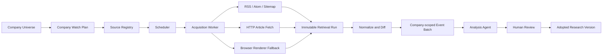

# 公司官方信息主动 Watch 技术方案

状态：提案，未实现

范围：公司官网博客、新闻、投资者关系、产品与技术更新的发现、冻结、变化识别和研究触发

首批验证对象：Alphabet / Google Blog，AMD 英文与简体中文 Blog

## 1. 问题与目标

Uteki 的公司观察池包含多家公司，但当前 Data Agent 只消费已冻结、已明确选择的资料，不负责从公开网站主动获取新来源。公司官网博客、新闻中心和地区站点持续发布产品、客户、技术、合作伙伴和战略信息，这些内容应成为持续研究输入。

本方案的目标是：

1. 每家公司都有一份显式的 Watch Plan 和官方来源覆盖状态。
2. 系统定期发现新文章、修订、撤回候选和地区独有内容。
3. 原始页面、规范化正文、抓取时间、地区、语言和版本均可追溯。
4. 抓取、变化识别、研究判断和正式采纳保持分离。
5. 普通 HTTP 无法可靠读取页面时，可以使用真实浏览器渲染，但不以规避网站限制或伪装成人类为目标。

本方案不包含：

- 自动修改当前研究基线。
- 自动形成交易建议或触发交易。
- 绕过登录、付费墙、验证码、WAF 或访问控制。
- 在没有公司和来源适配验证的情况下宣称支持全部公司。

## 2. 核心设计判断

“每家公司都有 Agent”实现为“每家公司有独立 Watch Plan，由共享执行基础设施调度”，而不是运行多个长期驻留的模型进程。

网页发现、下载、正文提取、hash 和 diff 都是确定性任务。只有出现实质变化后，才将固定的事件批次交给公司范围内的 Analysis Agent。这能减少模型成本、避免重复分析，并让失败和覆盖范围可审计。



## 3. 职责边界

| 模块 | 负责 | 不负责 |
| --- | --- | --- |
| Source Registry | 公司、来源、地区、语言、允许路径、合规状态 | 证明来源已成功覆盖 |
| Scheduler | 定时、队列、退避、重试、恢复 | 解释内容的研究意义 |
| Acquisition Worker | 发现 URL、下载公开内容、冻结原件 | 自动采纳研究结论 |
| Browser Renderer | 渲染 JavaScript、执行必要的公开页面交互 | 规避验证码或反自动化限制 |
| Normalizer | 提取正文和元数据、生成稳定内容身份 | 将不同地区内容自动视为翻译 |
| Diff Engine | 判断新增、修订、无变化、撤回候选和失败 | 宣称基本面发生变化 |
| Analysis Agent | 评估事件对假设、模型和研究结论的影响 | 覆盖已采纳版本或获得交易权限 |
| Reviewer | 审核、关联、接受或驳回候选 | 修改历史快照 |

数据获取和变化发布属于 Data 能力；变化的研究意义属于 Analysis 能力；定时运行和故障恢复属于执行基础设施。

## 4. 公司与来源覆盖契约

### 4.1 Company Watch Plan

每家公司必须显式记录：

- `company_id`
- 当前 Watch 状态
- 关注业务、假设和指标
- 来源 edition 列表
- 触发条件与复核周期
- 最近成功检查时间
- 已检查到的来源覆盖范围
- 责任角色
- 当前失败、积压或策略阻断状态

Watch 状态只允许：

- `configured`
- `coverage_gap`
- `manual_only`
- `blocked_by_policy`
- `temporarily_failed`
- `paused_with_reason`

没有来源配置的公司必须显示 `coverage_gap`，不能默认使用 Alphabet、第一条可用 URL、英文站或最新文章。

### 4.2 Source Edition

同一公司可以有多个地区或语言来源：

```yaml
edition_id: amd-blog-cn-zh-cn
company_id: amd
source_family: amd-official-blogs
publisher_scope: AMD official blogs for Simplified Chinese readers
landing_url: https://www.amd.com/zh-cn/blogs.html
discovery_url: https://www.amd.com/zh-cn.sitemap.xml
source_kind: sitemap
region: CN
locale: zh-CN
allowed_hosts:
  - www.amd.com
allowed_article_path: ^/zh-cn/blogs/[0-9]{4}/[^/]+\.html$
adapter_id: amd-blog
adapter_version: v1
poll_policy_id: official-blog-normal
policy_status: allowed
```

地区和语言必须进入 source edition 和 snapshot 身份。AMD 英文与简体中文内容即使 canonical、slug、标题或正文相同，也保留为两次独立发布观察。

## 5. 三层采集策略

### 5.1 L1：RSS、Atom、Sitemap 和公开 API

优先使用发布方明确提供的结构化入口。

优点：

- 不执行 JavaScript，资源消耗低。
- 容易进行条件请求和增量发现。
- 来源边界和字段更明确。
- 不依赖内部搜索接口。

约束：

- Feed 窗口可能不覆盖完整历史，需要单独的历史回补策略。
- Sitemap 的 `lastmod` 是资源更新时间提示，不能直接当作文章发布日期。
- Sitemap 可能包含作者页、专题页和首页，必须使用 edition 级路径规则筛选。

### 5.2 L2：普通 HTTP 正文获取

发现文章 URL 后，以普通 HTTP 获取文章正文：

- 只允许 HTTPS。
- 校验 host、端口、路径和重定向终点。
- 禁止访问内网、本机、云元数据地址和未登记域名。
- 支持 `ETag`、`Last-Modified`、`If-None-Match` 和 `If-Modified-Since`。
- 限制响应大小、下载时间、重定向次数和压缩比。
- 验证 MIME 类型。
- 不携带个人账号、登录 cookie 或浏览器历史。

### 5.3 L3：真实浏览器渲染 fallback

只有在下列条件成立时才使用 Playwright / Chromium：

- 普通 HTTP 只返回页面壳，正文由客户端 JavaScript 生成。
- 页面公开内容必须经过地区选择、分页或“加载更多”才能出现。
- 需要保存渲染后的可见正文或必要的视觉证据。

“模拟人浏览”的合规含义是使用真实浏览器执行页面公开交互，不包括隐藏自动化身份或绕过访问控制。

允许：

- 使用真实 Chromium 渲染。
- 显式配置 locale、timezone 和地区 edition。
- 点击公开的分页或加载按钮。
- 等待明确的 DOM 状态。
- 为审计保存必要截图和渲染 DOM。

禁止：

- Stealth 插件、浏览器指纹伪造。
- 随机鼠标轨迹、虚假停留时间等欺骗性行为。
- 住宅代理轮换以规避频控。
- CAPTCHA 破解。
- 绕过登录、付费墙、WAF 或访问控制。
- 冒充普通个人浏览器以隐藏 crawler 身份。
- 调用通过 DevTools 发现但未公开、且受页面策略限制的内部接口。

浏览器脚本使用明确的 selector 和停止条件，不使用随机 sleep 模拟人类。

## 6. 浏览器运行契约

每次浏览器运行至少记录：

- `company_id`
- `source_edition_id`
- `requested_url` / `final_url`
- `allowed_hosts` / `allowed_path_patterns`
- locale、timezone、viewport profile
- browser 和 interaction script 版本
- robots 与来源策略快照 ID
- started / finished 时间
- HTTP 与 render 状态
- DOM hash 和 visible-content hash
- 必要截图引用
- 失败分类

交互脚本应可人工阅读，例如：

```text
1. 打开 AMD 中文博客入口。
2. 等待 main 区域出现。
3. 如存在允许的“加载更多”，最多点击三次。
4. 只收集 /zh-cn/blogs/{year}/*.html。
5. 不进入 /search/。
6. 遇到登录、验证码或访问限制时停止。
7. 将停止原因记录为 blocked_by_policy 或 retrieval_failed。
```

## 7. 快照与证据模型

建议建立以下对象：

1. `CompanyWatchPlan`
2. `SourceEdition`
3. `RetrievalRun`
4. `SourceSnapshot`
5. `PublicationObservation`
6. `ChangeEventBatch`
7. `ReviewDecision`

每次文章观察保存：

- 公司、source edition、地区与语言
- requested、final、canonical URL
- `published_at`
- `first_seen_at`
- `last_seen_at`
- `source_lastmod`
- 标题、作者、分类
- HTTP validators 和 Content-Language
- 原始 HTML hash
- 渲染 DOM hash（如使用浏览器）
- 规范化正文 hash
- parser、adapter 和 browser 版本
- 原始文件、正文文件和必要截图
- candidate / review / adoption 状态
- 抓取错误和覆盖缺口

原始 HTML 与规范化正文必须分开：

- 原始 HTML 用于审计和重放。
- 规范化正文用于变化判断和研究输入。
- 动态脚本、追踪 ID、随机 DOM ID 或页面框架变化不能自动触发“文章修订”。
- 标题、正文、脚注、免责声明、表格和重要链接变化应生成 revision candidate。

所有历史快照不可变。新抓取产生新 retrieval run；不能原地覆盖旧快照。

## 8. 地区差异与本地化关联

同一 slug 的中英文内容只产生 `translation_cluster_candidate`，不能自动合并。

| 关联证据 | 处理方式 |
| --- | --- |
| 官方 `hreflang` 双向对应 | 高可信关联 |
| canonical / alternate 明确关联 | 高可信关联 |
| 同 slug 且标题、正文高度相似 | 候选关联，等待确认 |
| 仅发布时间接近 | 弱信号，不自动关联 |

需要保留：

- 真正翻译版本之间的内容差异。
- 不同地区的发布日期差异。
- 中文版增加或删除的段落。
- 地区独有客户、合作伙伴、渠道、活动与产品定位。
- 英文更新而中文未更新的状态。

“某地区正式发布了某条内容”本身可能是研究信号，因此即使正文 hash 相同，也不能删除地区 observation。

## 9. 事件类型与变化规则

事件类型：

- `publication_new`
- `publication_revised`
- `publication_metadata_changed`
- `publication_withdrawal_candidate`
- `regional_variant_discovered`
- `source_policy_changed`
- `retrieval_failed`
- `coverage_gap`
- `checked_no_material_change`

变化规则：

1. 同 URL、同规范化正文 hash：不生成内容变化事件。
2. 同 URL、正文 hash 改变：生成 `publication_revised`。
3. 只有原始 HTML 改变：保留 retrieval，不生成研究事件。
4. Sitemap `lastmod` 改变：重新抓取提示，不直接认定修订。
5. URL 暂时从列表消失：不能立即认定撤回。
6. 明确 404 / 410 或连续多轮缺失：生成 withdrawal candidate，等待复核。
7. 抓取失败：生成 `retrieval_failed`，不能转换成“没有新消息”。
8. 无实质变化也记录检查时间、来源范围和判定依据。

运行状态、研究结果和采纳状态分别保存：

- 运行状态：排队、执行中、失败、完成。
- 研究结果：有变化、无实质变化、资料不足、需纠错、存在分歧、过时。
- 采纳状态：candidate、reviewed、adopted、declined、superseded。

## 10. Analysis Agent 接入

采集阶段不调用模型。只有固定 event batch 出现以下内容时才触发 Analysis Agent：

- 新文章或正文实质修订。
- 地区独有披露。
- 既有证据撤回或更正。
- 与公司 Watch Plan 中业务、假设或指标相关的变化。

Agent 输入必须显式包含：

- company scope
- source edition scope
- knowledge cutoff
- 当前 adopted research version
- event batch
- 新旧正文 diff
- 相关假设和反证
- 最大步骤、时间和成本

Agent 输出只形成候选：

- 对原假设的支持、削弱、推翻、无实质影响或无法判断。
- 需要重新阅读和重算的范围。
- 正反证据与未解决问题。
- 是否需要领域 Agent。
- 是否建议形成 research update candidate。

Agent 不得自动覆盖 adopted research、获得交易权限或把公司宣传稿当作已经验证的事实。

## 11. 风险与合规控制

### 11.1 Robots 与站点策略

Crawler 每次运行前读取并缓存目标 host 的 `robots.txt`，遵守对应 User-Agent 规则。缓存一般不超过 24 小时；robots 因网络或服务器错误不可达时采用保守停止策略。

robots 不是访问授权机制，因此还需要独立记录站点条款、内容许可和内部使用范围。

Crawler 使用可识别身份，例如：

```text
UtekiResearchBot/0.1 (+purpose-and-contact-page)
```

Browser renderer 可以使用标准 Chromium，但不隐藏自动化用途。

### 11.2 风险矩阵

| 风险 | 控制 |
| --- | --- |
| robots 禁止 | 不访问，标记 `blocked_by_policy` |
| robots 暂时不可达 | 停止该 host，保留最后有效策略和错误 |
| 条款不明确 | `manual_only`，等待审核 |
| 登录或付费内容 | 不自动获取 |
| CAPTCHA / WAF | 停止，不绕过 |
| 服务器负载 | host 级并发 1、限速、条件请求、指数退避 |
| 版权与再分发 | 仅内部研究、限制正文外发、保留来源链接 |
| 个人信息 | 不采集评论、账号和订阅者信息 |
| Prompt injection | 页面文本始终作为不可信数据，不能成为 Agent 指令 |
| SSRF | host/path allowlist、DNS/IP 校验、阻断内网与云元数据地址 |
| 恶意文件 | MIME、大小、压缩比、解析超时和沙箱 |
| 研究误判 | 抓取、解析、分析、采纳状态分离 |

## 12. Google 与 AMD 的首批适配

### 12.1 Google Blog

来源：

- Landing：<https://blog.google/>
- 增量发现：<https://blog.google/rss/>
- 补漏与历史发现：<https://blog.google/sitemap.xml>
- robots：<https://blog.google/robots.txt>

策略：

- RSS 用于高频增量。
- Sitemap 用于每日补漏和历史发现。
- 正文使用普通 HTTP 优先。
- 正文为空或关键字段只在渲染后出现时才进入 browser fallback。
- 不访问 Google Blog `/search` 路径。
- Google Cloud、DeepMind、Research、Developers 和 Security 等卫星博客分别登记，主 RSS 不代表完整覆盖。

### 12.2 AMD 英文与简体中文 Blog

来源：

- 英文 landing：<https://www.amd.com/en/blogs.html>
- 中文 landing：<https://www.amd.com/zh-cn/blogs.html>
- 英文 sitemap：<https://www.amd.com/en.sitemap.xml>
- 中文 sitemap：<https://www.amd.com/zh-cn.sitemap.xml>
- robots：<https://www.amd.com/robots.txt>

策略：

- 英文和中文建立两个独立 source edition。
- 使用官方 sitemap 发现文章。
- 英文只允许 `/en/blogs/{year}/*.html`。
- 中文只允许 `/zh-cn/blogs/{year}/*.html`。
- 不访问 AMD `/search/*`，不依赖 Coveo 内部搜索接口。
- 正文普通 HTTP 获取失败且策略允许时，才使用 browser fallback。
- 同 slug 中英文可以关联，但不能覆盖或自动合并。

## 13. 调度、限速与恢复

建议以来源级策略配置频率，不在共享代码中硬编码公司特例：

- `core`：较高频率，但仍遵守 host 级限速。
- `active`：常规频率。
- `context`：低频率或事件驱动。

执行约束：

- 同一 host 默认并发 1。
- 优先条件请求，304 不下载正文。
- 429、503 和网络错误采用带上限的指数退避。
- 单次运行设置 URL 数、字节数、浏览器页数、总耗时和重试上限。
- 失败后从持久化任务状态恢复，不重新分析已处理 event batch。
- 相同 source edition、URL 和内容身份保持幂等。

## 14. 可观测性

至少监控：

- 来源覆盖率与过期覆盖数。
- 最近成功检查时间。
- RSS / sitemap / HTTP / browser 各层成功率。
- 新增、修订、无变化和失败事件数量。
- Browser fallback 比例。
- host 级请求量、429 / 403 / CAPTCHA 数。
- parser 失败和正文空结果率。
- 误触发、漏报、人工驳回和积压时间。
- 采集到 Review、Review 到 Adopt 的延迟。

页面状态应明确区分“没有新内容”“抓取失败”“等待复核”“策略阻断”和“经复核无实质变化”。

## 15. 交付阶段

### Phase 0：来源登记和政策审查

- 为公司观察池建立 coverage matrix。
- 每家公司至少登记一个官方源或显式 gap。
- 记录 robots、条款、地区、语言和 adapter 状态。

### Phase 1：确定性采集试点

- Google + AMD 英文 + AMD 中文。
- 实现 RSS、sitemap、HTTP、不可变快照和 diff。
- 暂不接模型，不内置浏览器。

### Phase 2：浏览器 fallback

- 只选择已经确认普通 HTTP 无法读取的页面。
- 实现版本化 Playwright 脚本和运行审计。
- 对比 HTTP 与 browser 结果，评估收益、成本和合规风险。

### Phase 3：Watch → Review

- 将 event batch 接入 Analysis Agent。
- 人工审核 candidate。
- 测量误触发、漏报、地区误合并和模型成本。

### Phase 4：扩展公司覆盖

- 按 `core → active → context` 扩展。
- 每个新 adapter 都完成独立 acceptance。
- 选择一个非 Google / AMD 公司验证迁移能力。

## 16. 首轮验收标准

1. Google、AMD 英文、AMD 中文三个 source edition 可以独立执行。
2. AMD 同 slug 的中英文页面分别保存且不互相覆盖。
3. 中文地区独有文章形成独立候选事件。
4. 连续检查中只有动态脚本、追踪 ID 或页面壳变化时，不产生 revision。
5. 正文真正变化时保留前后两个不可变版本。
6. Google / AMD 的受限 search 路径从未被请求。
7. 抓取失败与“没有新内容”是不同结果。
8. Browser fallback 有完整交互、版本、DOM 和必要截图记录。
9. 新内容只进入 `candidate_unreviewed`，未经 Review / Adopt 不进入当前研究基线。
10. 公司观察池每家公司都有显式覆盖状态；未配置公司显示 gap。
11. 来源内容中的指令无法影响系统工具权限或 Agent 控制流。
12. 使用独立公司和独立来源类型验证 adapter 边界，不以两个成功样本证明全面支持。

## 17. 实施前需要确认的产品决定

1. 50 家公司中首批 `core` 公司范围和优先级。
2. 原始网页正文和截图的保存期限及再分发边界。
3. 站点条款审查责任人和 `manual_only` 转 `configured` 的批准流程。
4. 哪类事件需要即时通知，哪类只进入待复核列表。
5. Browser fallback 可接受的运行成本、页面数和频率。
6. Analysis Agent 每次事件批次的模型、预算和最大步骤。

这些决定完成后，再进入 Phase 0 和 Phase 1；本提案本身不创建调度任务、不发起抓取，也不改变现有研究基线。
