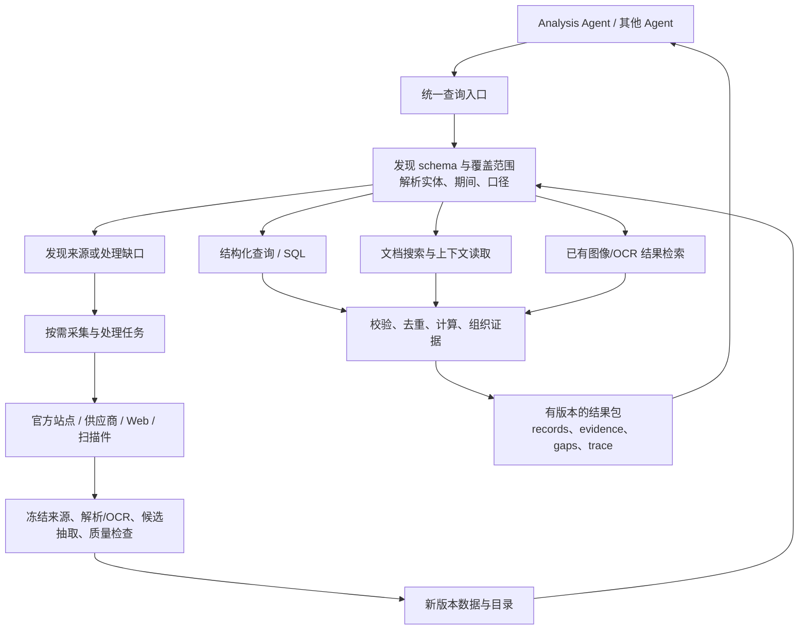

# Data Agent：Schema、查询与多来源数据能力

日期：2026-09-22。依据：当前仓库、抽取实验和用户对 Data Agent 的职责补充。初始交付为 schema 导出与架构方案；随后已完成 [第一轮本地查询闭环](DATA_AGENT_QUERY_PILOT_REPORT.zh-CN.md)：候选记录规范化、schema/覆盖发现、DuckDB 参数化取数、Decimal 计算、文档补读与 JSON CLI。下文保留方案形成时的设计基线，当前实现范围以执行报告为准。自主自然语言规划、OCR 和扩源编排仍待实现。既有快照、候选采纳与 Data/Analysis 边界继续有效。

## 1. 结论

目标是让其他 Agent 能不断提出研究问题，由 Data Agent 发现数据、理解口径、执行查询、补充处理并返回可追溯结果。**Text2SQL 是结构化数据上的关键执行路径；完整能力还包括文档检索、图像读取、来源发现、取数与校验。** 统一的是查询入口、语义和结果契约，各种数据保留适合自己的执行方式。

Analysis Agent 决定研究什么、如何解释；Data Agent 决定去哪里取数、能否比较、如何定位依据、哪些内容尚不知道。Data Agent 可以返回计算结果与管理层解释，不能把管理层说法自动提升为已证实因果，也不承担 Thesis 或买卖判断。

当前最该做的是 **统一可查询的数据契约、指标字典与覆盖目录，接通 SQL + 现有文档读取的一个最小闭环**。已有抽取工作是这个底座的上游，继续保留；质量评估从“能否生成 JSON”扩展为“另一 Agent 能否正确查到、理解并复核结果”。

## 2. 现有 schema 可以拿到，但需区分层次

本轮导出入口为 [schema 目录](schemas/current/catalog.json)，由 [导出脚本](../scripts/export_research_data_schemas.py) 从当前代码生成，并保存来源与 schema hash。

| 现有契约 | 获取方式 | 实际含义与限制 |
| --- | --- | --- |
| 本轮 LLM 抽取产物 | [extraction.schema.json](schemas/current/extraction.schema.json)；[实验冻结原版](../experiments/research_data_quality/2026-09-22-prompt-protocol/schema.json) | `records[] + gaps[]`，每条含 kind/entity/metric/period/value/upper/unit/summary/speaker/evidence/qualifiers/question_refs。是实验输出形状，不是 SQL 表定义 |
| Analysis 查询请求 | [research-data-query.schema.json](schemas/current/research-data-query.schema.json) | 已有 question、company、periods、source_policy 等字段；没有本提案的完整执行/资源/时间约束 |
| Data/Analysis 交接包 | [evidence-bundle.schema.json](schemas/current/evidence-bundle.schema.json) | 已有 snapshot、claims、metrics、evidence、unknowns；`MetricPoint.value` 仍为整数型旧契约 |
| 缺失数据请求 | [research-data-request.schema.json](schemas/current/research-data-request.schema.json) | 已有 ResearchDataRequest；当前本地实现写请求文件，并不会自主完成扩源工作 |
| Step 1–2 财务记录 | [financial_records.py](../src/uteki/infrastructure/research_data/financial_records.py) | `financial-records-v0.2`，已有详细 period、Decimal 字符串、单位、维度、来源、质量；当前是代码构造的字典，没有独立完整 JSON Schema |
| Step 3–4 电话会记录 | [transcript_records.py](../src/uteki/infrastructure/research_data/transcript_records.py) | `transcript-records-v0.2`，ManagementStatement / Guidance / QAExchange；同样尚未统一为正式类型模型 |

导出的是字段结构。Python `__post_init__` 的跨记录引用检查、证据定位和语义支持仍由代码负责；不能拿 JSON Schema 校验通过当作财务数据正确。现有文档索引也有自己的结构，不能把抽取 schema 用于全部原始文档与图像。

本轮验证：4 份导出通过 JSON Schema Draft 2020-12 结构检查，来源/输出 hash 一致；Extraction schema 与原实验冻结版本相同。12 份真实抽取输出通过该 schema、当前 Pydantic 模型及已有证据/归属校验。此结果不覆盖尚未实施的 SQL、统一金融语义或 OCR 能力。

当前事实：`LocalResearchDataPort` 读取 JSON 发布包并做词项过滤；`FinancialRecordPort.query` 按实体/指标/期间/as_of 过滤内存记录；`DocumentReader` 支持目录、字面搜索、完整表格/列表/Q&A 读取。Alphabet 有真实文档目录。尚未见统一研究 SQL 库、schema 发现接口、OCR、语义向量检索或 Web fallback 编排。仓库中的 SQLite 用于运行预算，不能视为研究数据库已经落地。

## 3. Agent 需要发现三种信息

只有 `value: string` 和数据库列名，不足以让 Agent 写出正确查询。

| 信息 | 应包含什么 | 解决的问题 |
| --- | --- | --- |
| 数据目录与能力 | dataset/source ID、实体、文档类型、覆盖期间、更新时点、处理状态、允许来源、检索方式、成本、权限、延迟 | 数据在哪里，当前有没有，应该调用什么 |
| 语义 schema | 类型、字段说明、指标定义与别名、主体/分部、单位/缩放、期间类型、实际/指引/预期、比例分母、可比较/可聚合规则、来源关系 | “Cloud 营收”“CapEx”“去年”到底表示什么 |
| 物理 schema | 实际表/视图、列类型、主外键、允许 join、支持算子、数据库方言、schema 版本 | 如何生成并验证 SQL |

目录中的“某期已下载”不能等同“该期所有指标都已抽取”。至少按指标×主体×期间区分：`available / source_present_unprocessed / source_missing / unsupported / conflict / access_denied`。`not_disclosed` 需要针对明确来源范围的覆盖证据，不能由一次搜索零命中推断。

`get_schema` 应按 dataset 与任务返回相关子集，附版本、定义、示例和缺失范围；不把整个数据库所有 DDL 塞给每次查询。金融别名映射必须版本化，例如管理层 CapEx 指引和现金流量表购买固定资产支出不能仅因同叫 CapEx 而合并。

## 4. 数据与查询的两条路径



**数据建设路径**：发现来源 → 固定原始版本 → 解析或 OCR → 抽取/规范化 → 校验/冲突处理 → 提交候选数据集 → 经既有规则形成可消费版本。SQL 表、全文索引和向量索引都是版本化材料的查询投影，可以重建。

**查询服务路径**：理解请求 → 发现相关 schema/覆盖 → 选择执行计划 → 运行 SQL/搜索/读取/计算 → 判断是否充分 → 返回结果或触发有界补数。查询不必每次重跑 OCR 或重新抓同一网页；缓存绑定来源 hash、处理器版本与参数。

同一 Data Agent 对外拥有两类能力，内部不需要每步配一个独立 Agent。解析、数值计算、ID、落盘、资源控制由代码执行；模型负责意图解析、计划选择和必要的语义抽取。先保留模块化单体。

## 5. 统一查询的数据模型应如何调整

不直接把实验里的 `records[]` 全部塞进一张 `metric,value,summary` 表。建议逻辑数据集如下，初期优先实现前六项并复用已有源文件：

| 逻辑对象 | 粒度与关键字段 |
| --- | --- |
| `datasets / sources / coverage` | 数据/来源版本、许可来源范围、发布时间、采集时间、处理状态、实体/指标/期间覆盖 |
| `entities / metric_definitions` | 公司/分部/证券区分；指标定义、别名、版本、单位、分母、口径、允许聚合 |
| `metric_observations` | 一项特定期间/维度/定义的披露观测：record_id、entity、metric、period、value、value_relation、value_kind、unit/currency/scale、dimensions、basis、source、status |
| `statements / guidance` | 发言原文、speaker、issued_at、target_period、modal/条件、定量或定性指引；历史事实和未来预期有独立身份 |
| `evidence / record_evidence` | 多对多映射；角色为数值/表头/单位/限定/问题；定位到 source hash、block/cell/页码/bbox 或供应商 response JSON pointer |
| `document_blocks / assets` | 可重建索引；完整表格、阅读单元、Q&A、图像和 OCR 版本，继续保留原始结构 |
| `computed_facts` | 公式 ID/version、操作数 record IDs、可比性校验、Decimal 结果、舍入规则 |
| `gaps / conflicts / jobs / query_runs` | 缺什么、搜过/处理过什么、为何不能回答、后续任务、执行计划和结果依赖 |

关键修正来自真实实验：

- **精确值和表达方式分开。** `value_relation = eq / approx / gt / gte / range / qualitative`，独立保留原文、情态与上下界。“略高于一半”可表示为阈值 50 + gt + percent，同时保留接近程度；不编码成精确 50%。“可能 40 年或更久”还有 `could` 情态，不能仅用 gte 就当作保证的下界。
- **比例分母显式化。** `cloud_ml_compute_share` 的分母是 ML compute；它无法替代 Cloud 占全部资本开支的比例。没有分母不能参与任意比例比较。
- **期间是结构，不只是标签。** 保存 quarter/ytd/year/instant、起止日期、财年；发言日期和预测适用期间分开。定性展望也需要目标期间或明确 unresolved 状态。
- **语义身份稳定。** `actual / management_guidance / consensus / estimate` 与 record type 分开；unit=USD 与原始显示 scale 分开。数值用 Decimal，不能默认浮点近似。
- **重复披露不重复计算。** 保留 CEO/CFO 两条 occurrence，建立同一 guidance 的关联；财务重复披露或重述也保留版本关系。未解决冲突时禁止静默选择一条，更不能求和。
- **候选状态可过滤。** 字段抽取/证据匹配/语义复核/发布是不同状态；生产默认数据策略与实验候选策略分开，查询结果必须回显使用了哪种状态。

多值、冲突或待审记录不能在 SQL 中靠 `DISTINCT` 假装解决。建立按数据版本和明确选择策略生成的查询视图，保留被排除记录、原因及可见覆盖；结果包仍返回相关冲突。

## 6. 对外接口建议

以下是新增能力提案，不是当前已经存在的函数。保留 `ResearchDataPort` 作为职责边界，用适配层兼容旧接口；不直接原地改写 v0.1 发布包。

```text
discover_data(intent, entity_ids, periods, source_policy_id, as_of)
get_schema(dataset_ids, schema_version, include_semantics=true)
query_data(DataQuery) -> QueryResult | QueryJob
get_evidence(evidence_ids, snapshot_id, detail_level)
request_data(DataAcquisitionRequest) -> DataJob
get_job(job_id) -> status + result_snapshot_id + gaps
```

`DataQuery` 在现有 ResearchDataQuery 上扩充：entity IDs、明确时间范围/期间类型、metric definitions、维度/口径、所需记录类型、`snapshot_id`、`knowledge_cutoff`、source policy、minimum_quality、是否允许扩源、时延/费用/调用上限、idempotency key。自然语言 question 继续保留；有明确字段时无需模型重复推断。

`QueryResult` 建议具有：result_schema_version、query_id、resolved_intent、status（complete/partial/ambiguous/unanswerable/failed）、snapshot/schema versions、records、computed_facts、evidence_refs、coverage、gaps/conflicts、query_trace_ref、cost/latency、continuation。Complete 必须相对于明确请求范围和检查规则；零行结果、执行失败和证据不足不可共用“成功”。

首次查询可以解析 latest 为具体目录/数据版本，后续调用固定该版本。扩源任务产生新版本与新结果；原查询结果不被覆盖。一个结果跨多个来源时固定 manifest。`knowledge_cutoff` 约束当时公开/可用的来源版本，`retrieved_at` 和记录入库时间另外保存；不能拿今天重述后的最新值冒充历史可知事实。

返回有界数据与可继续读取的定位符，不能把所有原文反复塞入上下文。执行轨迹记录解释后的目标、所用 schema、工具参数、SQL/计划和来源版本即可，不需要保存模型的内部推理链。

## 7. Text2SQL 路径的具体实现

首期建议 **DuckDB 作为本地结构化查询投影，现有 JSON/JSONL 与源文件继续留作版本化依据**。理由是当前已有批量实验文件，多期筛选、join 和聚合是主要需求；DuckDB 支持 Decimal，可避免 SQLite 默认浮点算术改变财务精度。此为建议，本轮未新增数据库依赖。先声明可支持的 Decimal 精度/scale，溢出或精度不足显式失败。

SQL 前增加很薄的语义解析层：自然语言 → 已解析查询（entity/metric/period/basis/filters/计算 ID）→ 校验 schema/覆盖 → 参数化 SQL。已注册的常见查询由确定性编译器生成；较自由的 Text2SQL 后续扩展到受验证的查询视图。调用方仍然提出业务 query，内部可以展示实际 SQL 供调试和复现。

例：“截至指定来源版本，Google Cloud 2026 Q2 与去年同期收入、营业利润和利润率是多少？”先确定主体是分部、期间是单季、同一报告口径、数值为 actual。以下为目标视图上的示例，并非当前可以运行的表：

```sql
SELECT record_id, metric_id, period_start, period_end, value_decimal, currency
FROM resolved_metric_observations
WHERE dataset_snapshot_id = :snapshot_id
  AND entity_id = :entity_id
  AND metric_id IN (:revenue_metric_id, :operating_income_metric_id)
  AND period_kind = 'quarter'
  AND period_end IN (:current_end, :prior_end)
  AND value_kind = 'actual'
  AND value_relation = 'eq'
  AND accounting_basis = :basis
  AND available_at <= :knowledge_cutoff;
```

上述命名参数由适配器绑定为实际驱动支持的形式。视图按 snapshot 的质量/冲突选择规则构建；若源记录不够，不补造行。查询后检查恰有 2 指标 × 2 期间、单位/定义/维度可比，再由注册公式计算利润率和变化，保存操作数与舍入。SQL 完成取数、join 和已允许的聚合；模型不做最终数值心算。

执行器只开放查询视图，使用参数绑定、解析后的单语句只读计划、函数/表白名单、行数/时限/内存限制；禁用任意文件、网络、扩展和写入能力。不能只检查 SQL 是否以 SELECT 开头。snapshot、source policy、数据状态由执行器落实，不能仅写在 prompt 中。

表结构有效只解决一类问题；期间不匹配、错误分母、重复 occurrence、非加总指标和缺失值都可能产生“能执行但错误”的 SQL，需要语义检查与结果检查。

## 8. 文档、图像与外部来源如何接入

| 查询/缺口 | 路径 | 返回与检查 |
| --- | --- | --- |
| 已结构化收入或指引 | schema/覆盖发现 → SQL | 类型化记录、单位期间、证据、冲突与缺项 |
| 电话会中的约束/原因 | 元数据筛选 → 关键词/全文检索 → 完整 turn/Q&A 读取 | 精确原话、说话人、条件、问题背景；管理层归因保持 attribution |
| 文件中的文字 | 按目录与版本限定的 grep/rg 或全文索引 | 命中仅作导航，回读完整表格/列表/上下文；查询词零命中不能说明未披露 |
| 扫描表格或图片文字 | 按 asset/source ID 调度 OCR → 表格/文字结构 → 规范化与核验 | 原图、页码/bbox、OCR 版本、原始识别与修正记录；低可信值保留 unresolved |
| 图表趋势、坐标或图例 | 图像理解/图表结构恢复与原图核对 | OCR 只能读文字，不能保证理解曲线/坐标；无法确定时返回可定位图像证据 |
| 本地有材料但未提取 | 定向处理任务 → 新候选 records → 再查询 | 不直接跳 Web，也不伪称源缺失 |
| 本地缺少来源或数据类型 | 官方发现接口/IR/供应商 → 必要时高质量 Web search | 来源能力、授权可用性、日期/修订、正文快照；网页摘要只作线索 |

Web search 支持主动发现和查询补充。按问题选择高质量来源：原始财务披露优先 SEC/发行人 IR；管理层发言优先正式 transcript/音视频；预期、定价等使用明确有能力的授权提供方。域名白名单只能筛一层，还须检查文档身份、日期、口径与来源链；不是品牌越大就永远覆盖一手材料。

外部获取失败、额度不足、权限不足、截至日期不满足或来源未披露都返回不同 gap。连接错误不是“没有数据”，检索分数也不是事实可信度。补数有最大工具调用、费用与时延上限；超界转 queued/partial，不无限循环。已存在的同 hash/版本任务复用结果，避免重复付费 OCR、反复抓取和重新抽取。

外部网页与文档内容作为待处理数据，不得改变工具权限或来源策略。供应商响应保存 request ID、response hash 与可回查的字段定位；没有原文时明确是 provider evidence，不伪造文档引用。

## 9. 让其他 Agent 消费

核心实现提供 Python Port 与 JSON CLI；MCP 或 HTTP 是同一契约的薄适配层。不同模型/Agent 看到一致的工具 schema、dataset 能力和结果结构。模型凭证和底层存储访问留在执行端；调用方身份、数据范围和预算沿用同一策略。

首个外部消费验收使用两个不同 Agent 客户端，对同一 query 和固定 snapshot 查询：得到相同的确定性指标/计算，证据可取回，遇到 ambiguity/gap 能继续请求而不是猜值。是否一次查询即可回答由 Data Agent 决定；Analysis Agent 可以提出新的研究 query。整个对话不要求一次把所有问题预先枚举。

本轮导出 schema 的 CLI 已可使用：

```bash
.venv/bin/python scripts/export_research_data_schemas.py
```

这一步仅提供现有契约发现的静态材料，尚未把上述新接口注册为 MCP/HTTP 工具。

## 10. 分步落地与前后对比

| 步骤 | 交付物 | 可直接查看/比较的结果 |
| --- | --- | --- |
| 0：现状 schema 盘点（本轮完成） | 4 份现有 schema、来源 hash、能力差距文档 | 现有数据有哪些字段，哪些只是代码字典，哪些能力仍未实现 |
| 1：统一语义契约与目录 | 财务/陈述/指引正式类型、指标字典、schema version、覆盖表；新旧适配器 | `50` 变为“阈值 50 + gt + 正确分母”；定性未来指引可独立查询；现有源记录逐条保留映射 |
| 2：结构化查询闭环 | DuckDB 版本化投影、查询编译/校验、注册计算 | 同一问题的解释后参数、SQL、命中记录、证据、利润率复算；对照旧内存过滤和模型计算 |
| 3：混合文档查询 | 查询路由 + 现有 DocumentReader + 证据拼接/充分性检查 | “拿到数值，再查约束”的一次混合查询；比较条件遗漏、归属、补读量与 token 成本 |
| 4：来源发现与按需加工 | registry、采集任务、OCR 适配、Web/供应商接入 | 未处理/缺来源/无法回答分开；新数据入候选版本，可复查网页/图像与定位；比较补数成功率与费用 |
| 5：其他 Agent 接入与端到端评测 | 统一 CLI/工具 schema、MCP/HTTP 按需要适配、外部客户端用例 | 同 snapshot 可重复查询；证据可追踪；部分结果能继续补数；不隐式修改旧研究 |

本表是新底座建设顺序，与旧“Step 1–5 抽取/消费实验”编号不同。旧 Step 5 的中断状态不因此改变；本方案不需要重新启动收费运行。本轮未新增任何模型、OCR 或 Web 调用。

首批回归问题直接来自已发现的问题：季度与半年混用；CapEx 指引与现金支出混用；两位说话人的相同指引被重复计数；“fairly similar”被变成精确预测；ML compute 分母丢失；正确操作数算出错误利润率；来源存在但未处理；缺失 2026 Q2 电话会；同期间冲突/重述；历史截止时点后才出现的材料；图表无可读文字。

评测逐层记录：实体/指标/期间解析正确率、SQL 语义正确性与执行成功、来源覆盖、数值与单位正确性、证据/限定/归属完整性、gap 识别、外部获取成功率、计算复现、时间与费用。评测参考与答案不进入被测 Agent 的输入。当前样本不能证明跨公司泛化；新增未参与 prompt 改写的季度、公司和图像样本后再评估。

先完成 1–3 的小闭环能最早检验这个架构：现有真实记录能否变成其他 Agent 可以自行查、反复查且不误读的数据。4–5 在同一契约上逐步接入，不需要推倒现有解析器，也不把更换 prompt 当作整个问题的解决方案。
