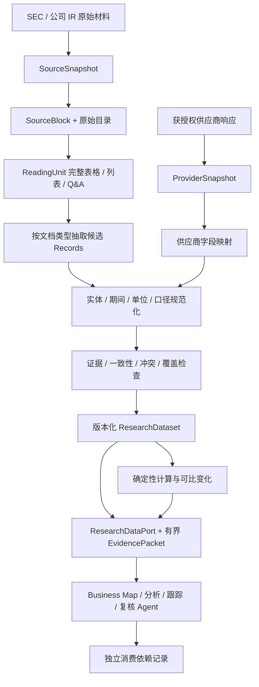

# Uteki 研究数据质量：与 Claude Financial Services 的比较及优化建议

日期：2026-09-22。状态：**技术提案，未实施，不变更既有里程碑验收结论**。

执行更新：Step 1–4 的有限实现见 [优化报告](RESEARCH_DATA_OPTIMIZATION_REPORT.zh-CN.md)。后续 [Claude 指令改写的 12 次真实抽取对照](CLAUDE_EXTRACTION_PROMPT_REPORT.zh-CN.md) 已完成，显示部分证据关联改善，也提示应补比较符/近似程度、预测身份和语义关系校验。Step 5 已真实调用，但因截断及重跑连接失败尚未完整验收。下文保留长期提案，未实现的契约不能视为已交付。

职责补充：根据后续讨论，Data Agent 的目标进一步明确为来源发现/处理与其他 Agent 的统一查询底座。新增 [Schema 与统一查询方案](DATA_AGENT_QUERY_ARCHITECTURE.zh-CN.md)，将 Text2SQL、文档检索、按需 OCR 与外部补数纳入同一语义和结果契约。本轮已导出现有 schema；统一语义目录、SQL 投影和查询/扩源编排仍为待实施方案，不改变下文已完成步骤及旧 Step 5 的状态。

后续执行：已完成 [本地查询底座第一轮](DATA_AGENT_QUERY_PILOT_REPORT.zh-CN.md)，在 4 份冻结来源上建立 37 条候选记录的语义/覆盖目录、DuckDB 查询、确定性计算与文档混合读取。自然语言自主规划和外部补数仍未实现；旧 Step 5 状态不变。

长期目标是把 10-K、10-Q、电话会等材料转成更优质的结构化研究数据，供后续 Agent 查询、消费和分析。本次要回答的是：**我们的处理方法与 Claude Financial Services 有何差异，哪些差异值得优化，当前应先做什么，以及为什么。** Claude Financial Services 是比较对象；是否接入 Claude、商业数据或新基础设施，由实测缺口决定。

核验依据：用户讨论稿、当前 Uteki 代码和材料目录，以及 Anthropic 官方仓库固定版本 [`574ed3624aebd0418c7e96cd101262f30210ab26`](https://github.com/anthropics/financial-services/tree/574ed3624aebd0418c7e96cd101262f30210ab26)。本次完成研究、相关离线回归与方案修订，没有模型调用、商业数据连接或应用代码改动。

## 1. 评估结论与当前优先级

**保留现有 Data Agent → 版本化数据 → Analysis Agent 的架构；优先测清抽取质量，并补齐财务事实与跨期语义。当前没有足够证据支持更换底层解析器或运行框架。**

### 1.1 先纠正讨论中容易误导的地方

1. **公开技能的数据能力不等于 Claude 模型的解析能力。** 已核验的 S&P 财务流程大量消费供应商已规范化的数据；上游如何解析申报、怎样人工维护映射，并未在这些技能中公开。不能据此认定 Claude 读 10-K 比 Uteki 准。
2. **若干技能串出的总体架构，是有依据的归纳，不是已验证的一套统一流水线。** 不同插件的来源约束、schema、持久化和检查强度并不完全一致。
3. **为一份报告挑出的中间文件，不等于可供长期研究复用的完整数据集。** 例如 Earnings Preview 固定选四段重要原话、定量指引和主题 [S2]，适合该报告；把这个选择直接当成 Data Agent 的全部产出，会漏掉其他研究问题所需的限定、反证和定性指引。应保存完整源与覆盖记录，再按任务生成摘要。
4. **Uteki 已经有数据与分析分离、不可变 Bundle、证据和缺失请求。** 这些写在现有架构与交接契约中，并非本次才需要引入的新方向。Business Map 作为结构化数据的一种视图也已被明确；本次建议是使具体实现更好地符合这些边界。
5. **旧候选打包器的限制，不代表 Uteki 全部方法的水平。** `_metric_from_claim()` 确实由展示文本反解析数值；但 Cloud spike 已有从原始表格、XBRL 校验后产生事实的路径。应复用后者，不能把整个项目描述成只有 claim 字符串。

### 1.2 按处理层判断，而不是笼统判断“解析好不好”

| 处理层 | 当前证据 | 判断与原因 |
| --- | --- | --- |
| 获取与来源版本 | Uteki 已保存来源、索引和 hash；供应商提供更多数据类别 | 扩源是覆盖问题；不能用数据类别多证明 parser 更好。当前先用已有材料评估 |
| HTML/PDF → blocks/表格/轮次 | Uteki 保留合并单元格、法定目录、完整列表及 Q&A；本次相关 39 项回归通过 | 继续复用。测试说明已覆盖行为正常，不证明全篇、跨发行人或任意 PDF 完整正确 |
| 读取范围与证据语境 | Cloud spike 用固定章节与字面匹配；reading groups 明确不解析远端附注 | 有可确认的能力边界，但实际重要遗漏率未测。先做来源侧遗漏审计，按错误决定补检索还是补脚注 |
| 数值与财务语义 | 旧包固定 FY2025；Cloud 路径已核验 context/unit/concept，但限定主体与年份；旧 MetricPoint/series 接口不适合多期 | 有具体的结构性扩展障碍。优先把已有 source-first 数值路径用于下一组真实指标，并补期间/单位/序列身份 |
| 电话会语义记录 | 已有 speaker/role/exchange；上游技能明确抽 quote/guidance 等，但公开 schema 并不完整 | 在现有解析结果上试验结构化指引与说话归属，保留完整 Q&A；暂无理由重写 PDF parser |
| Agent 消费 | 已有 ResearchDataPort/Bundle；来源阅读与窄域 snapshot 实现并存 | 用同一任务比较事实错误、遗漏和补读代价，再决定是否统一持久化与接口；不能用报告篇幅代替收益 |

### 1.3 现在最该做什么

**第一步：完成一份小范围、分层的错误审计。** 从冻结的年报、Q2 季报与电话会出发，先独立标注应提取的数据，再核对现有索引、读取范围和记录；区分 parser、检索、抽取、规范化、计算、消费错误。已有 M0 试标/遗漏检查继续沿用，不另外声称已经有新 Gold。详见第 9、10 节。

**第一项有明确依据的工程优化：将 source-first 财务值路径从 Cloud 窄域试点扩到一个可比季度样本。** 直接读取表格/iXBRL，保存明确期间、单位、口径与证据，区分 record 与 series，缺口按指标×期间报告。理由是现有单期模型确实无法完整表达多期输入；并非已证明现有所有金额算错。当前 Cloud claim `$58.705B` 本身也保留了精度，不能把潜在格式化风险写成已经发生的错误。

**第二项候选优化：给现有电话会读取结果增加最小的类型化记录。** 先做管理层陈述、指引和来源归属，验证条件/期间/问答语境能否完整保存。扩充多少类型，由下游具体问题与遗漏样本决定。

远端附注、语义检索、更多指标、供应商对照、更完整的 Dataset/血缘服务，均按实际失败与复用需要逐项推进。第 4–8 节描述长期可兼容的目标契约，不是当前必须一次性建设的清单。长期目标不变，投入顺序由可复现错误和下游收益决定。

最终验收问题是：**换一个下游 Agent，它能否用同一数据包正确回答问题、核查证据、识别不确定性，并复算数字？**

## 2. Claude 有哪些数据源：已核验与待验证分开

### 2.1 官方公开仓库列出的来源

仓库 README 列出了下表中的连接器；“被列出”不代表我们已经开通，也不代表各产品版本支持所有字段或历史快照 [S1]。

| 来源组 | 仓库中的提供方 | 本次核验到的用途 | 来源缺口出现后的调研优先级 |
| --- | --- | --- | --- |
| 公司基本面、历史财务、分部、预期、价格、关系 | S&P Global / Capital IQ / Kensho | 技能明确查询财务 line item、segments、consensus、价格、竞争对手、业务关系、电话会；Kensho Grounding 提供搜索来源 [S2]、[S3]、[S10] | 高；作为已有规范化数据的补充或对照 |
| 财报 actual、consensus 与材料 | FactSet、Daloopa | Earnings Reviewer 明确使用二者取得 actual、consensus、10-Q/8-K，并读取完整电话会 [S8] | 高；字段、原文定位、历史版本需另验证 |
| 基本面、预期、行情及跨资产数据 | LSEG | 合作方文档列出 estimates、fundamentals、equity prices、macro、rates/FX 等 [S12] | 中；可比数据与市场输入扩展 |
| 其他金融、新闻与事件来源 | Morningstar、Moody's、MT Newswires、Aiera | 当前 README 列出了连接器；本次未验证其具体数据字段、电话会覆盖或订阅层级 | 按缺口调研，不能直接视为已有能力 |
| 私募及私有资产相关来源 | PitchBook、Chronograph | 当前 README 列出；本次未验证具体实体、交易和历史数据能力 | 当前 10-K/10-Q 试点之后 |
| 文件与企业材料库 | Egnyte、Box | 是材料访问入口，不是天然标准化的财务数据库 | 只在确有相应材料时接入 |

S&P 合作方 README 明确说明：其技能与底层数据访问并非 Claude 专属，支持其他平台/框架，但仍需要相应 S&P 订阅 [S11]。因此可借鉴方法，也可以将获授权的供应商数据直接接到 Uteki；不必先让 Claude 写成一份报告，再从报告反抽数据。

对每个未来数据适配器，先记录 `capabilities`：支持的文档/指标、实体 ID、期间粒度、调整口径、source locator、as_of 历史版本、更新延迟、费用和缓存/再分发规则。准确边界依实际接口与权限验证，不能只按品牌名推定。

### 2.2 两条不同的数据路径

**路径 A：供应商已结构化的数据 → 映射与校验 → Uteki records。**

这是已核验的 S&P 财务技能大量采用的方式。示例函数包括 `get_financial_line_item_from_identifiers`、`get_segments_from_identifiers`、`get_consensus_estimates_from_identifiers`；这是技能文档中的接口用法，本次未真实调用。模型主要选择查询、组织结果与解释。

**路径 B：10-K/10-Q/电话会原始材料 → 解析 → 抽取 → 校验 → Uteki records。**

本次核验的公开技能没有提供一套可直接替代 Uteki 的通用、完整原始申报解析器。电话会的原话/指引提取方法较明确，但仍是工作流指令与有限 schema，不能等同于已经完成通用的数据规范化。

Uteki 的主要建设在路径 B，路径 A 通过同一契约进入。两条路径保留各自来源；供应商规范化值与发行人披露有差异时记录冲突和定义，不简单规定“供应商永远对”或“官方文本永远优先”。

### 2.3 哪些做法值得采纳，哪些需要加固

| 上游做法 | 保留的价值 | Uteki 的加强点 |
| --- | --- | --- |
| 查询后立即写中间文件、报告前重读 [S2]、[S3] | 减少上下文压缩丢失，允许复用 | 宿主强制落盘与 hash 校验，消费端只能读取已提交版本 |
| 原话必须 verbatim，保留 speaker/context [S2] | 证据可检查 | 校验 block + offset + quote；译文单独存；原话正确不等于观点属实 |
| 先 financials/segments，再 calculations [S3] | 披露值与派生值分开 | 固定公式、类型化操作数、期间和单位校验，不靠 LLM 心算 |
| `financials.csv` 等按用途拆分 [S3] | 有清晰的中间产物 | 权威结构用 JSON/JSONL，CSV 为导出；补齐实体/期间/币种/口径/版本 |
| 管理层指引、drivers、headwinds、Q&A 分类 [S2] | 对下游研究有用 | “管理层解释的原因”与“分析 Agent 推断的原因”分开 |
| 实时 earnings workflow 要求最新 90 天材料 [S4] | 防用错最新季度 | Uteki 用显式 period/cutoff/mode，允许有标记的历史复核 |
| Thesis scorecard 跨会话保存 [S6] | 提示要追踪下游状态 | 不把 thesis 混进证据事实；消费依赖独立保存 |

上游实现也存在不能照搬的地方：Tear Sheet 总规则要求中间文件，但其 Equity Research 查询计划中 stock performance 有“直接进文档”的例外 [S10]；Earnings Reviewer 的 transcript-reader schema 主要是 ticker、period、actuals、guidance_notes，缺少逐项 quote/speaker/locator [S9]。应学习设计意图并用 Uteki 契约补足，不把参考模板当作完整质量保证。

## 3. 当前 Uteki 中具体应调整的逻辑

下表是实现差距及相应修法，不代表每项都需要立即实施。当前优先处理财务契约和小范围评估；读取、发布和血缘的扩充由评估结果触发。

| 位置与当前行为 | 问题 | 推荐变更 |
| --- | --- | --- |
| `research_data/artifacts.py::_metric_from_claim()` 从 `$…B` 的 claim 字符串经 float/round 转为数值，固定 FY2025/三种字段 | 更接近既有候选打包，不能作为通用原始财务抽取；已格式化值可能丢精度 | 新数据管线从表格单元格/iXBRL context 产生 MetricObservation；用 Decimal 保留原始值 |
| `build_research_data_artifacts()` 读取 benchmark_dir 的 claims、spans 和 review_decisions | 原候选的发布路径不是独立在线抽取路径 | 保留为旧发布重放；新执行只读批准来源，产物不得依赖 Gold/评测意见 |
| `sec_index.py` 保留表格 row/column/合并信息，法定目录为 document/part/item | 原文结构可靠，但不等于已恢复业务语义与财务口径 | 保留冻结索引；在独立 ReadingUnit/Extraction 层补语义，不重写法定层级 |
| `reading_groups.py` 已连起列表、邻接表头/单位与紧邻脚注 | 能减少断章取义；远端附注没有完整关联 | 增加可验证的脚注/附注关联；未解析的依赖列为 gap，不猜关系 |
| `earnings.py` 已有 speaker/role/turn/exchange，`DocumentReader` 会扩展完整 Q&A | 不应重复造对话解析层；speaker 仍依赖规则识别 | 复用并测试异常格式，保留未知 speaker；在其上抽取 guidance、解释与 Q&A 主题 |
| `cloud_llm.py` / `cloud_spike.py` 已校验具体表格、XBRL context/unit/scale/concept | 有很好的最小实现，但硬编码 Google Cloud、年份与指标，不是通用 parser | 提炼并加固已验证能力，逐个指标开放；不把所有标签默认为可用 |
| `MetricPoint.metric_id` 既作值身份又用于 series 查询，包内要求唯一；`value:int`、`period:str` | 多期多口径不好表达 | 分离 observation_id 与 series_key，结构化 period/unit/accounting_basis |
| `ResearchClaim` 偏向 business field + 中英文字段；`EvidenceLink` 与 claim 绑定 | Quote、Guidance、Q&A、变化不能自然表达；证据难独立复用 | 新增有明确类型的 Records 和独立 EvidenceSpan；旧对象作兼容投影 |
| `LocalResearchDataPort.compare_periods()` 按是否出现某期间报告缺口 | 该期间有一个指标，不代表所有目标指标齐备 | 按 subject × metric × period × basis 返回 coverage matrix |
| 当前报告分析路径可从 read 工具取得来源内容，另一条窄域路径已消费结构化 snapshot | 重复抽取、口径不稳是需测量的风险，尚未量化影响 | 同一任务对比两类输入；收益成立后优先复用冻结数据，并经 Data 端按需展开依据 |
| 现有 archive lineage 为报告/意见/基线关系 | 无法直接追踪哪个事实更正影响哪一段判断 | 新增 Record → Calculation → Consumer revision 的依赖边；旧机制保留 |

这些变更针对新的数据版本。既有 EvidenceBundle、原始索引、公司名单、报告快照与人工采纳记录不回写。当前 M0 BusinessMap 输出契约也不顺手扩成一个通用多文档 schema。

## 4. 推荐的数据处理架构

这是现有模块化单体的演进方向，沿用已有 Data/Analysis 职责边界；图中节点不代表都要新建服务、Agent 或文件模块。先有真实使用方和经过评估的需求，再补实现。



层次分工：

- **原始层**保存真实字节与时间，不解释经济含义。
- **阅读层**组织完整语境；summary 只作导航，不能替代证据。
- **抽取层**保存披露内容、管理层说法与证据；模型识别的是候选。
- **规范化与质量层**明确对象含义，处理单位、期间、冲突和缺口。
- **派生层**进行有公式的计算与可比数据变化。
- **消费层**根据下游任务组合数据包；研究意义由下游判断。

不对每层机械配置一个 Agent。解析、数值解码、ID、公式、校验、持久化和权限由代码完成；LLM 用在语义分类、业务映射建议、条件/解释抽取等环节。未确定业务归属时允许候选实体与映射待审，不为了全量结构化强行归类。

## 5. 三种材料分别怎么处理

### 5.1 10-K：年度结构与基线披露

1. 固定 accession、form、period_end、filed/accepted 时间、source hash；原文与图片保留。页码与网页定位都能回查。
2. 复用法定 Part/Item 索引。首期选择与问题有关的 Business、Risk Factors、MD&A、Financial Statements/Notes；每一块标记 processed/excluded/failed，排除附理由，不能宣称已抽取全篇所有信息。
3. 为表格建立含表头、期间、单位、行名、脚注的 ReadingUnit；业务叙述保留完整列表及引导句；附注跨段关联保留 source refs。
4. 结构化抽取两类数据：数值从原始表格/iXBRL 读取；业务、收费方式、客户类别、产品、关系、约束等生成披露陈述。区分报告分部、经济业务与收入线，不能把品牌/产品名自动当可独立估值业务。
5. 同一指标多处披露时保留各 occurrence；校验定义、期间、主体与合并/分部口径后再建立 equivalent 关系。
6. 从这些 records 派生 Business Map 视图；它仍是版本化候选，包含解释/映射的部分保留 basis 与证据，不反过来成为原始财务值的唯一来源。

**iXBRL 补强：**保留 concept、contextRef、entity、start/end/instant、dimensions、unitRef、scale、sign、decimals/precision、原始展示文本及原文位置。第一版只支持经过测试的标签/格式；continuation、transform、nil、多标签单元格、重复事实、扩展 taxonomy 与合并单元格需显式处理或报 unsupported。现有 Cloud spike 的字符串 context 检查应升级为结构化维度解析，而不是靠包含“Cloud”和年份判定通用可比性。

### 5.2 10-Q：当期数据与披露变化

1. 固定本期材料身份，识别季度、YTD 与 instant。10-Q 不是缩短版 10-K；通常不能期待完整 Business 内容。
2. 财务抽取复用指标契约，但分别保存当季、年初至今、去年同期和资产负债表时点。相同标签若 context 不同，必须是不同 observation。
3. 必要的单季现金流由同一口径 YTD 差额得到，输出为 ComputedFact；不能直接当成发行人原文披露，也不能用半年数除季度收入。
4. 将本期与可比披露版本做字段级比较，输出：new_disclosure、value_change、restated、reclassified、explicitly_unchanged、not_covered、unresolved_conflict。
5. “本季没有重复提及某风险”通常是 not_covered，不能等同风险消失；“披露文字变化”也不能直接当作业务事实变化。
6. 需要年度背景时，以引用方式关联指定 10-K record，不把整份年报重新复制成当季事实。对先前 guidance 的对照必须说明是哪一次指引、适用哪个期间。

数据层可以给出“本季 operating margin 比可比去年同期变化多少 bps”，不能直接给出“因此长期 thesis 已被推翻”。后者交给下游 Analysis/Review。

### 5.3 电话会：原话、条件与问答语境

1. 区分 prepared remarks、analyst Q&A、closing；保存 speaker 原始标签、角色、turn、exchange、页码/可用时间戳。
2. ReadingUnit 使用完整 Q&A：分析师问题、所有管理层回应、追问与补充。若超预算不静默截掉回答；分块需父 exchange ID、覆盖范围与可取回的完整上下文。
3. 抽取 ManagementStatement、Guidance、ManagementExplanation、QAExchange，保留否定、条件、时间限定与比较对象；“will”“expect”“may”不能都规范化成已发生事实。
4. Guidance 区分 point/range/qualitative；说话日期、适用期间、币种、GAAP/调整口径分别保存。没有明确数值就不生成数值预测。
5. 管理层解释用 `attributed_cause → described_effect` 加 attributed_to/evidence 表达；这是“管理层归因”，不是系统证明的因果关系。
6. QA theme 是导航/组织标签。分析师问题中的数字只是 analyst assertion；未被管理层确认时不能混入公司实际指标。“回避问题/回答不足”是待复核标注，不是抽取事实。

原话必须匹配冻结文本；中文翻译独立保存。PDF 提取文本匹配不等于已完成原页/OCR 准确性验收，证据仍应能展开到原 PDF。

## 6. 给 Agent 的核心数据结构

### 6.1 共同外壳 + 类型化 payload

所有对象有 `record_id`、schema_version、company/entity、source_refs、extractor/normalizer_version、created_at 与 quality；具体内容用有辨识字段的类型，避免一个任意 subject-predicate-value 吞掉所有语义。

| 类型 | 核心 payload | 典型消费方 |
| --- | --- | --- |
| `MetricObservation` | series_key、metric、period、value_decimal、unit、currency、scale、accounting_basis、dimensions、raw_value | 财务分析、计算、趋势跟踪 |
| `DisclosureStatement` | statement、subject、topic、qualifiers、basis=explicit、evidence_refs | Business Map、业务理解、风险研究 |
| `ManagementStatement` | quote、speaker、role、context、topic、modality、target_period | 管理层观点与论证 |
| `Guidance` | metric/subject、point/range/qualitative、bounds、conditions、issued_at、target_period | 前瞻对照、后续跟踪 |
| `ManagementExplanation` | attributed_cause、described_effect、qualifiers、speaker、evidence_refs | Driver 候选、验证问题 |
| `QAExchange` | question_refs、answer_refs、followup_refs、participants、topic_tags、annotation_status | 争议点、研究问题与反证搜索 |
| `RelationshipAssertion` | source_entity、target_entity、relationship_type、direction、valid_period、evidence_refs | 业务结构/供应链/竞争关系 |
| `DisclosureChange` | before_refs、after_refs、comparison_basis、change_kind、gap_reason | 跨期分析与验证 |
| `ComputedFact` | formula_id/version、operand_record_ids、result_decimal、unit、rounding、comparability_checks | 指标与情景计算 |
| `DataGap / Conflict` | scope、missing_or_conflicting_fields、candidate_refs、reason、resolution_status | 所有消费者 |

这是目标契约范围，不要求第一批实现每一种关系与事件。数值试点先覆盖 Metric 与 Gap，计算复用现有能力；电话会试点再补陈述/Guidance，并引用已有 Q&A。Change、关系、独立依赖索引在真实消费需求明确后加入。

### 6.2 Metric 身份与期间

```text
record_id          一条不可变记录的身份
series_key         entity + metric + dimensions + unit/currency + accounting_basis + value_kind + period_kind
period             start / end / instant + fiscal_year/quarter + quarter/ytd/year/instant
value_kind         actual / management_guidance / consensus / internal_estimate
value_decimal      Decimal 字符串；原始文本另存
source_refs        单元格、表头、单位和必要脚注的确定版本
```

series_key 不含具体起止日期，但区分 quarter/ytd/year/instant 与 actual/guidance/consensus；同一 series 可有多个期间，也可有同期间的原披露与重述版本。相同 series 并非自动可比：YTD 还须匹配累计时长，财年长度、分部重组与定义版本另校验。缺值为 null + 原因，不作 0；NA、未披露、不适用、未抽取、解析失败要区分。

实体映射版本化：发行人、证券类别、报告分部、经济业务、产品、第三方实体分开。GOOG/GOOGL 的证券 ID 不能替代 Alphabet 公司 ID；识别一家公司为供应商也不意味着把它加进用户 watchlist。

### 6.3 EvidenceSpan 与可信边界

文档证据：`source_snapshot_id + source_sha256 + index_id + block_id + text_hash + locator`。文本 offset 基于冻结 block.text 的 Unicode code point，左闭右开；校验 `text[start:end] == quote_original`。表格另带 cell 坐标与表头/单位/脚注 refs；多个 source spans 可以支撑一条记录。

供应商证据：`provider + query/request_id + response_sha256 + record_key/JSON_pointer + as_of/retrieved_at`。没有原文 block 时不伪造 block_id；消费者能区分“原始披露证据”和“供应商记录证据”。

quality 至少拆分：source_integrity、locator_match、value_parse、period_unit_mapping、semantic_support、human_review。逐字匹配与结构正确不等于事实完全成立；不使用 `confidence: 1.0` 作为统一可信结论。模型给出的置信度若保留，应单独标识未校准，不用作事实采纳门槛。

### 6.4 来源时间、去重与冲突

分别保存 period、event_at、published_at、retrieved_at、provider_as_of 和 recorded_at；日期不详保留精度。回溯查询指定“截至什么时间可用的哪个版本”，不能取今天供应商更新后的数据冒充历史状态。

同一财报在 SEC、公司 IR、供应商重复出现，保留多个来源 occurrence 和 source_event 关系，不按来源数量累加独立佐证。同一对象多值时先检查 restatement、reclassification、单位、GAAP/non-GAAP、地域/分部维度与期间。只在精确满足去重规则时合并视图；原始记录不删除，冲突对象保留双方。

consensus 若用于 Beat/Miss 必须具有发布前 as_of；当前 latest estimate 不是历史事前预期。找不到版本时返回 gap。

### 6.5 计算与可比性

首期只实现实际使用的注册公式：同比、营业利润率、利润率变化 bps、Capex/Revenue，及有明确口径的 YTD 差分。所有操作数指向确定 record version，结果保存 formula/version 与完整依赖。

计算前检查期间/币种/业务/调整口径一致；同比基期非正、零分母、缺期、分部重组或单位未明返回 not_meaningful/not_comparable。segment 占比用合并收入并解释抵销；资本开支明确定义；供应商返回的比例不冒充本地复算。

计算代码不执行模型生成的任意表达式。LLM 可以建议要算哪个注册指标，但由宿主解析 record ID、验证类型并计算。

## 7. ResearchDataset 与下游消费协议

### 7.1 持久化产物

JSON/JSONL 是权威产物；CSV、Markdown、Business Map 为派生视图。一次 DataRelease 包含：

```text
data/research_data/<company>/<release_id>/
  manifest.json             # schema, code/config versions, hashes, source cutoffs
  sources.json              # 来源版本、事件、时间与来源政策
  entities.json             # 只含本次相关实体与映射版本
  records.jsonl             # 类型化记录
  evidence.jsonl            # 原话/单元格/供应商记录定位
  calculations.jsonl        # 固定公式及操作数
  changes.jsonl             # 只有本次比较确实执行时才提供
  coverage.json             # 文档/读取单元/字段的覆盖矩阵
  gaps.json                 # 具体缺口
  conflicts.json            # 尚未解决的差异
  validation.json           # 机器检查与人工审核分开
```

抽取运行原始输入、响应、模型/Prompt、失败与用量在 `data/agent_runs/<run_id>/`；Gold 与评分在 evaluation/benchmarks，执行侧不读取。发布使用临时文件 + fsync + 独占 manifest 提交，文件 hash 通过后才可消费。

数据发布的“已提交可读”、机械校验的“通过”、人工语义审核的“接受”是不同状态。下游请求指定所需质量级别；候选可用于明确的实验，不能悄悄进入已确认的生产基线。

### 7.2 数据端口

在现有 ResearchDataPort 思路上增加版本化接口。以下为拟议能力，不是现有方法：

```text
open_dataset(release_id, source_cutoff, quality_policy)
get_metric_series(subject_id, metric, periods, dimensions, accounting_basis)
query_disclosures(subject_id, topics, record_types)
get_guidance(subject_id, issued_before, target_period)
get_changes(base_release_id, current_release_id, comparable_scope)
get_evidence(record_ids, include_context=true)
build_evidence_packet(task, record_ids, token_budget)
request_missing_data(DataRequest)
```

每个响应包含 dataset_id、版本、结果、每项质量状态、coverage、gaps/conflicts 与 continuation。显式请求找不到对象或质量不满足时返回原因；不暗自使用另一个模型会话、公司、版本或最新来源替代。

默认交付 **结构化数据 + 最小完整证据上下文**。可以渐进展开到表格/附注/完整 Q&A；不能只交几十个抽离上下文的三元组，也不能默认把全部旧报告和全文塞进一个 Prompt。

预算不足时按任务优先级选 packet，但给出 omitted/pending 项与可继续读取标识。summary 只指路，最终引用要落到真实 evidence。服务端检查 source policy、company、release 和数据质量权限，客户端或模型不能自行提交任意文件路径扩展范围。

### 7.3 消费血缘

保存独立的边：`producer_record/version → consumer_run/report/hypothesis_revision`，区分 supplied、read、cited、operand、support、opposition。结构化输出中显式引用的 record ID 由宿主验证；不声称捕获模型内部所有推理。

不把 consumed_by 数组写回不可变证据。反向索引可从 manifests/edges 重建；首期无需图数据库。上游纠正时，列出依赖旧值的下游对象并标记待复核；旧运行输入不重写，新修订仍走原人工审核/采纳机制。

`Business Understanding/Driver/Thesis/Tracker` 是消费者产物；其中事实可引用数据层，因果判断和投资解释留在研究状态中。对通用数据层的更新，不以某一份报告的观点为事实依据。

## 8. 抽取和 review 策略

每个文档类型使用小而独立的 ExtractionSpec：record types、目标指标/主题、批准来源区域、输出 schema、必须保留的限定条件、完整性检查和停止条件。配置 source/prompt/schema/normalizer 版本，避免把数百页材料交给“自由总结”提示词。

数值路径优先确定性解析和候选定位；模型负责表格语义/实体映射建议，程序验证 value、context、unit 等。叙述路径由模型提出记录与证据，程序检查定位，人或独立审核判断语义支持与遗漏。

审核需要两种视角：

- **记录 → 来源**：这条指标/陈述是否正确，证据是否支持全部限定条件？
- **来源 → 记录**：重要表格、指引和反证是否被遗漏？只复核已有记录无法测出漏抽。

可以用不同模型做局部 reviewer，输出具体 source/record IDs、问题类型与建议，不投票自动变成事实。只有存在待解决的语义分歧或错误样本时才增加模型审核；不把“两个 Agent 都同意”当独立证据。

Claude、GPT 等都通过同一抽取端口接受材料、schema 和资源上限，输出原始响应、候选、usage 与错误。模型不能写已发布数据、改来源、读 Gold 或采纳自身结果。调用前预算预留；失败费用未知时保持 unknown。具体模型、API 能力与价格在执行前验证，本方案不要求更换 Uteki 全部运行框架。

## 9. 先评估，再按证据实施

### 9.1 第一组评估材料与问题

先用已持有的一家公司材料评估方法：FY2025 10-K + **2026 Q2 10-Q** + 已有 2025 Q4 电话会/发布稿。2026 Q1 10-Q 作为计算 Q2 单季现金流的补充。Q2 的三个月、六个月和期末数能暴露期间混淆；Q1 的当季和 YTD 时间范围相同，仅用 Q1 不能充分测试这个问题。目录中的 Q1/Q2 来源及索引文件夹本次已确认存在。

这些材料**不是同一季度的匹配套件**：年报/电话会验证年度披露与管理层语境，Q2 独立验证季度/YTD；不用 Q4 call 代答 Q2 管理层说法。后续若验证同季财报与电话会互证，再取得对应材料并单独冻结。

逐步实验的 Step 0 来源检查发现 Q4 发布稿原文 hash 与清单/索引声明不一致，已 [记录并暂时排除](../experiments/research_data_quality/2026-09-22-step-00/README.zh-CN.md)。其余四份材料通过本次原文与索引指纹检查；发布稿核对后以新来源版本单独加入，不混入当前对照。

首组研究问题：Google Cloud 的披露业务范围是什么，收入和营业利润的期间/口径是否可比；公司资本开支哪些是已发生值、哪些是未来指引，条件是什么。Capex 必须采用明确的财务定义，不能把全公司资本开支分配成 Cloud 分部支出。

建议预先冻结以下小样本范围，而不以抽取结果决定分母：两类财务表的目标行及全部有关表头/单位/附注；Cloud 业务披露的完整列表；电话会中相关管理层指引及其完整 Q&A；另留一组未用于调整规则的表格/问答作检验。取多少条由真实披露决定，未披露和未找到分开记录。当前样本只能评估 Alphabet 这些版式，不支持跨公司准确率结论。

当前目录有 18 份 SEC 申报记录及 FY2025/Q4 电话会/发布稿；其他季度电话会明确未采集。现有研究包 `data/research_data/alphabet_2025_10k/v0.2-candidate/` 含 57 claims、13 metrics、80 evidence links，指标仅 FY2025 的 revenue/operating_income/operating_loss；它不代表其他候选或 Cloud spike 的能力范围。这些是代码/目录观察，不代表本次完成完整来源核验。

R2-A 执行记录已定位第 90 段为空格导致的旧摘录不一致，新候选直接从来源取摘录并完成机械核验；人工异常处置复核仍待完成。该问题不能继续笼统归因为 parser 错误，也不能把工程修复计为人工审核通过。冻结评估材料时采用匹配的来源/index/摘录身份，保留旧审计链。

### 9.2 每项工作都有进入和停止条件

| 顺序 | 具体工作 | 进入依据与完成判据 |
| --- | --- | --- |
| **现在先做：评估基线** | 来源清单、应提取字段/语境、现有路径输出和逐项错误归因；复用已有评测边界 | 得到可重放的问题清单：原文有无、解析有无、是否读到、记录是否正确、下游是否用对；未测项明确列出 |
| **首项工程优化：财务记录** | 复用 `cloud_llm.py/cloud_spike.py` 的 source-first 路径；在数据模型补 record/series、typed period/unit/basis；`local.py` 按指标×期间报缺口 | 当前代码已显示单期限制。能正确表达同指标多期、Q2 vs YTD，金额不经展示文本反推；每项指到原单元格/语境；不支持的标签明确拒绝 |
| **第二项候选：电话会记录** | 在 `earnings.py` / `DocumentReader` 的 turns/exchanges 上增加陈述/Guidance 抽取 spec | 来源侧参考和实际下游问题明确后试验；原话、说话人、条件、未来期间不丢失；问题中未确认数字不成为公司事实 |
| **按失败触发：读取补强** | 调整 `reading_groups.py` 的附注关联或检索策略 | 只有出现重要信息已在源中、却不在正确读取单元的样本时扩大；已读到但理解错的问题归抽取/语义，不归 parser |
| **按复用需求触发：通用发布与消费** | 逐步扩展 `ResearchDataPort`、版本化记录和兼容投影；计算/变化引用确定操作数 | 第二个实际研究任务证明重复抽取或格式阻碍复用后建设；值、来源和缺口稳定，旧读取路径仍可重放 |
| **按来源缺口触发：供应商对照** | 单一 provider adapter；原始响应与映射版本；必要时与原披露对照 | 要解决明确的 consensus、跨公司覆盖或更新成本问题；只有订阅/样本可用才评估，差异保留定义和时点，不自动覆盖来源 |

每次只改变可归因的一项：先固定来源与模型比较处理规则，再固定管线比较模型。若当前任务上原始结构已经完整，不继续改 parser；若新记录未改善事实可靠性或复用，不为了统一 schema 扩大改造。尚无完整误差分布与人工审核投入数据，本次不沿用此前“几天完成整条数据层”的排期估计。

新文件与公共抽象只在实际实现时建立，遵循项目既有的模块化单体与“真实使用方先于共享工具”约定。第一批无需通用知识图谱、全部 Record 类型、新运行框架或多 Agent 部署。

### 9.3 对现有逻辑的迁移规则

1. 保留旧 EvidenceBundle/BusinessMap 及其重放；新 Dataset v1 独立发布。
2. 引入 adapter 将新记录投影成旧界面能读的字段；不能反向用旧界面的格式化文本填充新精确数据。
3. 下游先按任务切换输入：仅测试任务从新 Dataset 读，相同来源保留旧路径对照。
4. 新数据缺失时，返回明确 gap 或显式申请原文补读；不从历史答案/模型记忆补齐。
5. 建立同 source hash + extractor/schema/mapping 版本的幂等缓存；改抽取规则时生成新版本，允许比较，不复写。
6. 更正与采纳解耦；数据对象被人工接受不自动采纳任何研究结论。

本提案与现有 M0 的来源、Gold、遗漏检查及单因素实验相衔接；新增跨材料评估单独标注范围。当前里程碑和季度研究验收不因本次建议自动变更，不能以数据结构升级替代研究验收。

## 10. 怎样证明“数据更优质”

具体执行与展示按 [逐步优化与结果对照](RESEARCH_DATA_STEPWISE_EVALUATION.zh-CN.md)：Step 0 保存现状，随后逐项比较财务记录、跨期、电话会、必要的读取修复与下游消费；每次既对照父版本，也对照 Step 0。最新执行状态与结果见 [优化报告](RESEARCH_DATA_OPTIMIZATION_REPORT.zh-CN.md)。

### 10.1 公平比较 Claude 与 Uteki 的三个实验

| 比较 | 固定的条件 | 能回答什么，不能回答什么 |
| --- | --- | --- |
| 当前 Uteki 处理 vs 借鉴上游方法后的处理 | 相同源字节、模型版本、任务、预算与留出样本；只改一项规则/契约 | 能判断保存中间结果、语境或类型化数据是否有收益；不能归因于 Claude 模型更好 |
| Claude 抽取 vs GPT 抽取 | 相同阅读单元、schema、来源范围和资源限制；分别保留失败与用量 | 能比较模型在我们的任务上的抽取差异；一次示例或报告观感不足以得出稳定性结论 |
| Uteki 原始披露路径 vs 供应商数据 | 相同指标、公司/分部、期间、币种、调整口径与可用时点 | 能比较数据覆盖、定义差异、回溯与维护代价；它不是两款模型/原文 parser 的直接较量 |

模型实验与商业数据对照尚未执行，未对任一方报告准确率。当前已做的是公开方法核验、代码差距审阅与有限离线回归。

### 10.2 质量指标与错误归因

| 维度 | 测量方法 |
| --- | --- |
| 数值正确性 | value + entity + metric + period + unit + dimensions + accounting_basis 整组比较，不仅数字相同 |
| 原话与归属 | quote exact match、speaker/role/context、否定/条件/期间限定是否正确 |
| 覆盖和召回 | 从源材料独立标出重要披露，与抽取结果匹配；未处理和未披露分开计数 |
| 跨期可比性 | 是否误混季度/YTD、GAAP/adjusted、分部重组、重述前后版本 |
| 证据可用性 | record 能否展开到正确且完整的表格/脚注/Q&A；供应商证据是否诚实标识 |
| 冲突和未知 | 冲突是否被发现、是否保留双方；缺值有原因，不能被模型补写 |
| 可复用性 | 两个不同研究任务消费同一 release，无需重复抽取，数据值与来源保持一致 |
| 下游收益 | 同模型/同任务，旧输入方式与新结构化输入对比：事实错误、错引、遗漏、补读次数、token 和人工复核时间 |

先锁定来源、评测样本和规则，再比较旧路径与新路径；两者使用同一模型时先测处理逻辑。之后固定新管线，比较 Claude/GPT 抽取差异。材料或模型同时变化的结果不能单独归因为数据管线提升。

工程硬门槛包括引用全可定位、类型与完整性检查、固定计算可重放、时点过滤、崩溃/重试幂等与旧数据不覆盖；语义准确性/召回率要人工标注实测，不预设未经验证的 95% 或节省 50%。多模型复核不能代替 source-first 的遗漏检查。

优先负例：同数不同指标、千/百万、Q2/YTD、负基数、复合表头、分部抵销、重述、拼接引文、问题中未经确认的数字、错 speaker、条件句丢失、Q&A 截断、旧 call 代答新季度、三处转载被当三份独立证据、未来数据混入。评测 Gold 不进入运行端。

### 10.3 本次实际验证

2026-09-22 在当前工作区执行：

```bash
.venv/bin/python -m unittest tests.unit.test_sec_document_index tests.unit.test_reading_groups tests.unit.test_document_reader tests.unit.test_earnings_materials tests.unit.test_cloud_llm
```

结果：**39 项通过**。覆盖现有目录/表格结构、列表和读取、完整 Q&A、来源绑定，以及 Cloud 的数值/单位/期间/替代表格验证等既有回归。它支持保留这些已有实现，不是全库验证，也不是独立的语义准确率或遗漏率测量。

Cloud 历史实验记录中，曾因验证器只识别特定表头误拒绝另一张合法收入表，后已改用财务 concept 验证并补回归。这是“模板约束需以语义上下文加固”的真实案例，已经修复，不能当作待修故障或重写 parser 的理由。历史 7 条结果一致也只对该窄域候选参考成立。

## 11. 参考资料和核验边界

外部来源固定到同一 commit。本次阅读的是公开技能、查询计划、模板和仓库说明；没有验证商业接口返回、账户权限或真实模型输出。因此供应商精确覆盖、费用与历史时点能力仍需实施时确认。

[S1]: https://github.com/anthropics/financial-services/blob/574ed3624aebd0418c7e96cd101262f30210ab26/README.md
[S2]: https://github.com/anthropics/financial-services/blob/574ed3624aebd0418c7e96cd101262f30210ab26/plugins/partner-built/spglobal/skills/earnings-preview-beta/SKILL.md
[S3]: https://github.com/anthropics/financial-services/blob/574ed3624aebd0418c7e96cd101262f30210ab26/plugins/partner-built/spglobal/skills/tear-sheet/SKILL.md
[S4]: https://github.com/anthropics/financial-services/blob/574ed3624aebd0418c7e96cd101262f30210ab26/plugins/vertical-plugins/equity-research/skills/earnings-analysis/references/workflow.md
[S6]: https://github.com/anthropics/financial-services/blob/574ed3624aebd0418c7e96cd101262f30210ab26/plugins/vertical-plugins/equity-research/skills/thesis-tracker/SKILL.md
[S8]: https://github.com/anthropics/financial-services/blob/574ed3624aebd0418c7e96cd101262f30210ab26/plugins/agent-plugins/earnings-reviewer/agents/earnings-reviewer.md
[S9]: https://github.com/anthropics/financial-services/blob/574ed3624aebd0418c7e96cd101262f30210ab26/managed-agent-cookbooks/earnings-reviewer/subagents/transcript-reader.yaml
[S10]: https://github.com/anthropics/financial-services/blob/574ed3624aebd0418c7e96cd101262f30210ab26/plugins/partner-built/spglobal/skills/tear-sheet/references/equity-research.md
[S11]: https://github.com/anthropics/financial-services/blob/574ed3624aebd0418c7e96cd101262f30210ab26/plugins/partner-built/spglobal/README.md
[S12]: https://github.com/anthropics/financial-services/blob/574ed3624aebd0418c7e96cd101262f30210ab26/plugins/partner-built/lseg/README.md

- [官方数据连接器与整体组成][S1]
- [S&P 电话会抽取及中间产物规则][S2]
- [Tear Sheet 的数据文件 schema][S3]、[实际查询计划][S10]
- [财报更新工作流][S4]、[Thesis Tracker][S6]
- [Earnings Reviewer 的来源选择][S8]、[Transcript Reader 实际 schema][S9]
- [S&P 平台适用范围与订阅要求][S11]、[LSEG 来源与能力][S12]

关键本地依据：

- [当前数据包构建与 claim 数值解析](../src/uteki/infrastructure/research_data/artifacts.py)
- [研究数据模型](../src/uteki/domain/research_data/models.py)、[端口](../src/uteki/domain/research_data/port.py)、[本地查询](../src/uteki/infrastructure/research_data/local.py)
- [SEC 索引](../src/uteki/infrastructure/document_sources/sec_index.py)、[阅读分组](../src/uteki/agents/reading_groups.py)、[文档读取](../src/uteki/agents/document_reader.py)、[电话会解析](../src/uteki/infrastructure/document_sources/earnings.py)
- [Cloud 的表格/XBRL 校验实现](../src/uteki/infrastructure/research_data/cloud_llm.py)、[规则版本](../src/uteki/infrastructure/research_data/cloud_spike.py)
- [现有计算](../src/uteki/agents/evidence_math.py)、[百分比覆盖检查](../src/uteki/agents/numeric_review.py)、[研究档案](../src/uteki/agents/research_archive.py)
- [架构边界](ARCHITECTURE.zh-CN.md)、[已确认的 Data/Analysis 交接契约](DATA_ANALYSIS_AGENT_CONTRACT.zh-CN.md)、[当前 M0/v0.2 计划](releases/V0_2_PLAN.zh-CN.md)
- [R2-A 来源及摘录核验记录](releases/V0_2_R2A_EXECUTION.zh-CN.md)、[Cloud 历史实验及已修复的验证问题](GOOGLE_CLOUD_LLM_SPIKE.zh-CN.md)
- [本地申报目录](../data/document_library/alphabet/catalog.json)、[电话会资料缺口](../data/document_library/alphabet/earnings.json)

引入上游配方的改编实现时保留许可证、归属和修改说明。商业数据访问与再分发许可独立于开源代码许可；本仓库为公开仓库，未来供应商原始响应不自动进入 Git。
